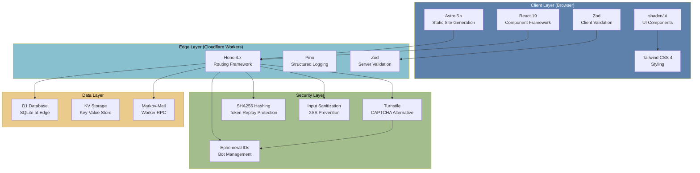
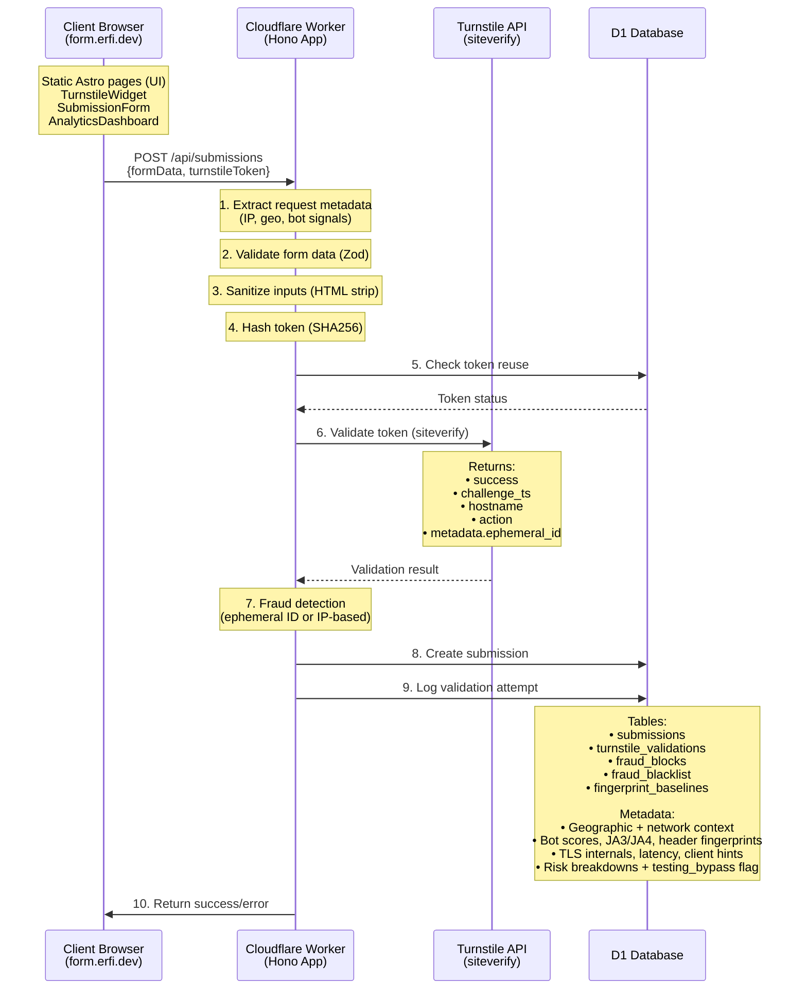
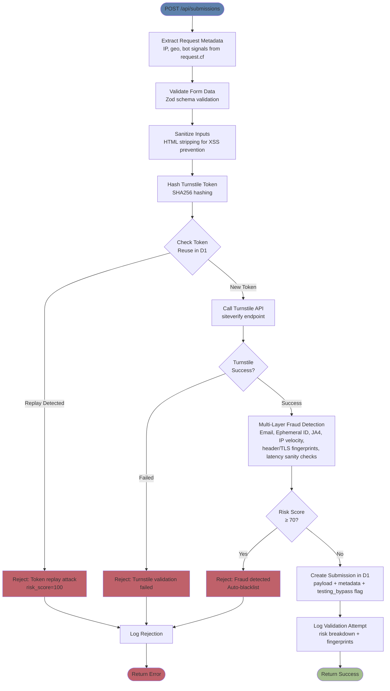
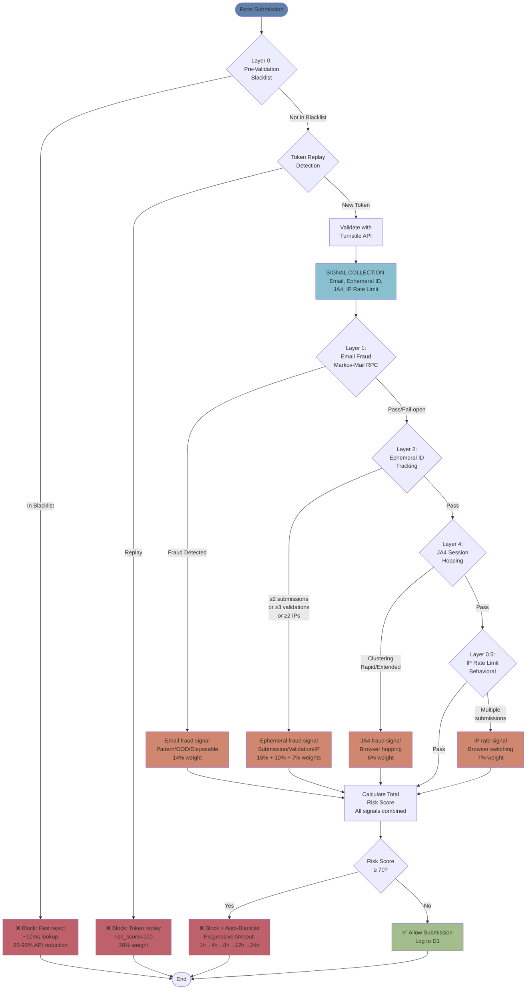
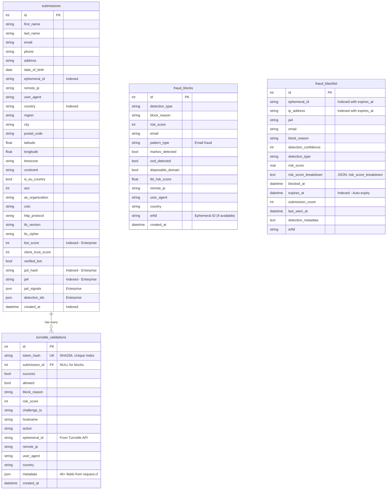
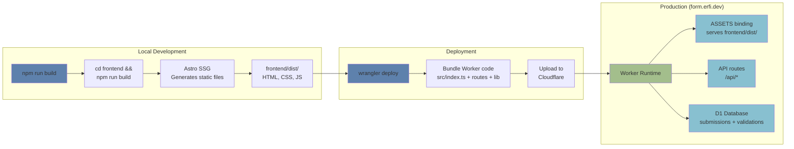

# Architecture

## Overview

Forminator is a full-stack Cloudflare Turnstile demonstration showcasing:
- **Frontend**: Astro static site with React components (shadcn/ui) and dark mode
- **Backend**: Cloudflare Worker with Hono routing framework
- **Database**: D1 for storing form submissions with rich metadata (40+ fields)
- **Security**: Single-step Turnstile validation with fraud detection

## Project Structure

```
forminator/
├── frontend/                    # Astro static site (UI only)
│   ├── src/
│   │   ├── components/         # React components (shadcn/ui)
│   │   │   ├── SubmissionForm.tsx
│   │   │   ├── AnalyticsDashboard.tsx (modular design)
│   │   │   └── analytics/     # Analytics components
│   │   ├── hooks/              # Custom React hooks
│   │   ├── layouts/            # Astro layouts
│   │   ├── pages/              # Astro pages (NO API routes)
│   │   └── styles/             # Global CSS
│   ├── astro.config.mjs
│   └── package.json
│
├── src/                         # Cloudflare Worker (Backend - at root)
│   ├── index.ts                # Hono app entry + asset serving + dynamic routing
│   ├── routes/                 # API routes
│   │   ├── submissions.ts      # Form submission endpoint (with testing bypass)
│   │   ├── analytics.ts        # Analytics endpoints
│   │   └── geo.ts              # Geolocation endpoint
│   └── lib/                    # Business logic
│       ├── router.ts           # Dynamic route configuration
│       ├── turnstile.ts        # Turnstile validation + fraud detection
│       ├── database.ts         # D1 operations
│       ├── validation.ts       # Form validation (Zod)
│       ├── email-fraud-detection.ts  # Markov-Mail RPC
│       ├── scoring.ts          # Normalized risk scoring
│       ├── fraud-prevalidation.ts    # Pre-validation blacklist
│       ├── ja4-fraud-detection.ts    # JA4 session hopping
│       ├── logger.ts           # Pino logging
│       └── types.ts            # TypeScript types + metadata extraction
│
├── wrangler.jsonc              # Worker configuration
├── package.json                # Worker dependencies
├── schema.sql                  # D1 database schema
├── docs/                       # Documentation
└── README.md                   # Main readme
```

## Tech Stack



### Frontend
- **Astro 5.x**: Static site generation
- **React 19**: Component framework
- **shadcn/ui**: Copy-paste component library
- **Tailwind CSS 4**: Utility-first CSS
- **Zod**: Client-side validation

### Backend
- **Hono 4.x**: Lightweight routing framework
- **Cloudflare Workers**: Edge compute platform
- **D1**: SQLite at the edge
- **Pino**: Structured logging
- **Zod**: Server-side validation

### Security
- **Turnstile**: CAPTCHA alternative
- **Ephemeral IDs**: Enterprise Bot Management feature
- **Token Replay Protection**: SHA256 hashing
- **Input Sanitization**: XSS prevention
- **Parameterized Queries**: SQL injection prevention

## Request Flow



### Request Processing Pipeline



## Key Implementation Details

### Worker at Root Level

The Worker is the main project, with the frontend as a subdirectory:
- `src/` contains Worker code (Hono app, routes, lib)
- `frontend/` contains Astro static site
- Worker serves static assets from `frontend/dist` via ASSETS binding
- Single deploy: `npm run deploy` builds frontend + deploys worker

### Single-Step Validation

Turnstile tokens are single-use. The implementation uses a single endpoint:
- Client collects form data + Turnstile token
- Single POST to `/api/submissions` with all data
- Server validates token, checks fraud, creates submission atomically
- Token is hashed (SHA256) and stored to prevent replay attacks

### Static Site Generation

Frontend uses Astro SSG:
- `frontend/dist/` contains static HTML, CSS, JS
- Worker serves these files directly
- Hydration for React components (client:load)

### Fraud Detection Strategy



**Behavioral Signal Architecture**:
- All detection layers collect signals (not hard blocks)
- Signals combined via weighted risk scoring (10 components total; 9 for submissions, token replay for validations)
- Fingerprint heuristics (header reuse, TLS anomaly, latency mismatch) sit alongside IP rate limiting to catch single-attempt bots
- Holistic decision made based on total risk ≥ 70
- Prevents false positives from single signal triggers

**Layer 0.5: IP Rate Limiting**:
- Detects browser-switching attacks (Firefox→Chrome→Safari)
- 1-hour window, tracks submissions per IP
- Non-linear risk curve: 1→0%, 2→25%, 3→50%, 4→75%, 5+→100%
- 7% weight in total risk score
- Complements fingerprint-based detection (Layers 2 & 4)

**Ephemeral ID Detection (Layer 2)**:
- Enterprise Bot Management feature
- 24h window for submissions, 1h for validation frequency
- Tracks: submission count (≥2), validation attempts (≥3), IP diversity (≥2)
- 15% + 10% + 7% combined weights in risk score

### Database Schema Design



**Core Tables**:

1. **submissions**
   - Form payload (names, email, optional phone/address/DOB)
   - Full request metadata (geo, network, TLS, client hints, header snapshot)
   - Bot & fingerprint data (bot scores, JA3/JA4, JA4 signals, header fingerprint)
   - Risk artifacts (`risk_score_breakdown`, `email_fraud_signals`, `form_data`, `extended_metadata`)
   - Tracking (`ephemeral_id`, `erfid`, `testing_bypass`, request headers JSON)

2. **turnstile_validations**
   - Raw Turnstile response (success, allowed, block_reason, challenge_ts, hostname, action)
   - Token replay hash and optional `submission_id` FK
   - Same metadata payload as submissions for blocked attempts
   - Detection context: `detection_type`, `risk_score`, `risk_score_breakdown`, `testing_bypass`

3. **fraud_blocks**
   - Pre-Turnstile blocks (email fraud heuristic, pre-validation blacklist, etc.)
   - Stores detection metadata, email-specific fields, `risk_score`, `fraud_signals_json`, `erfid`

4. **fraud_blacklist**
   - Progressive timeout entries for email / IP / JA4 / ephemeral IDs
   - Includes `risk_score`, `risk_score_breakdown`, `detection_metadata`, `offense_count`, `expires_at`

5. **fingerprint_baselines**
   - Cache of known-good header/TLS fingerprints keyed by JA4 + ASN buckets
   - Used to short-circuit anomaly lookups while keeping a trail of when a fingerprint was last seen

**Key Indexes**:
- `token_hash` (unique) - Prevents token reuse
- `ephemeral_id` - Fast fraud detection queries
- `created_at` - Time-based analytics
- `email`, `country`, `ja3_hash`, `ja4`, `bot_score` - Analytics performance

### Metadata Extraction

40+ fields extracted from request.cf:

```typescript
export function extractRequestMetadata(request: CloudflareRequest): RequestMetadata {
  const cf = request.cf;

  return {
    // Geographic (9 fields)
    country: cf?.country,
    region: cf?.region,
    city: cf?.city,
    postalCode: cf?.postalCode,
    latitude: cf?.latitude,
    longitude: cf?.longitude,
    timezone: cf?.timezone,
    continent: cf?.continent,
    isEUCountry: cf?.isEUCountry,

    // Network (5 fields)
    asn: cf?.asn,
    asOrganization: cf?.asOrganization,
    colo: cf?.colo,
    httpProtocol: cf?.httpProtocol,
    tlsVersion: cf?.tlsVersion,
    tlsCipher: cf?.tlsCipher,

    // Bot Management (6+ fields - Enterprise only)
    botScore: cf?.botManagement?.score,
    clientTrustScore: cf?.botManagement?.clientTrustScore,
    verifiedBot: cf?.botManagement?.verifiedBot,
    ja3Hash: cf?.botManagement?.ja3Hash,
    ja4: cf?.botManagement?.ja4,
    ja4Signals: cf?.botManagement?.ja4Signals,
    detectionIds: cf?.botManagement?.detectionIds,

    // Request (3 fields)
    remoteIp: headers.get('cf-connecting-ip'),
    userAgent: headers.get('user-agent'),
    timestamp: new Date().toISOString()
  };
}
```

### Dynamic Routing System

Configurable API endpoints via environment variables:

```jsonc
// wrangler.jsonc
"vars": {
  "ROUTES": {
    "submissions": "/api/submissions",  // or "/sign-ups", "/v2/forms", etc.
    "analytics": "/api/analytics",
    "admin": "/api/admin",
    "geo": "/api/geo",
    "health": "/api/health"
  }
}
```

**Implementation** (`src/lib/router.ts`):

```typescript
// Load routes from environment with in-memory caching
export function getRouteConfig(env: Env): RouteConfig {
  if (cachedRoutes !== null) return cachedRoutes;

  const routes = typeof env.ROUTES === 'string'
    ? JSON.parse(env.ROUTES)
    : env.ROUTES;

  const merged = { ...DEFAULT_ROUTES, ...routes };
  cachedRoutes = merged;
  return merged;
}

// Match incoming path against configured routes (longest-prefix matching)
export function matchRoute(path: string, routes: RouteConfig): keyof RouteConfig | null {
  const normalizedPath = path.endsWith('/') && path.length > 1
    ? path.slice(0, -1)
    : path;

  // Sort by length (longest first) for correct matching
  const sortedRoutes = Object.entries(routes).sort(
    ([, a], [, b]) => b.length - a.length
  );

  for (const [name, pattern] of sortedRoutes) {
    // Exact or prefix match
    if (normalizedPath === pattern || normalizedPath.startsWith(pattern + '/')) {
      return name as keyof RouteConfig;
    }
  }

  return null;
}

// Strip route prefix for handler normalization
export function stripRoutePrefix(path: string, routePattern: string): string {
  if (path === routePattern) return '/';
  if (path.startsWith(routePattern + '/')) {
    return path.slice(routePattern.length);
  }
  return path;
}
```

Features:
- In-memory caching (single parse per worker instance)
- Longest-prefix matching prevents `/api/sub` matching `/api/submissions`
- Route configuration visible in wrangler.jsonc

### Testing Bypass System

API key-authenticated testing mode for CI/CD and local development:

**Configuration:**
```jsonc
// wrangler.jsonc
"vars": {
  "ALLOW_TESTING_BYPASS": "false"  // MUST be false in production
}
```

**Implementation** (`src/routes/submissions.ts`):
```typescript
// Check if testing bypass is allowed
if (env.ALLOW_TESTING_BYPASS === 'true' && apiKey && apiKey === env['X-API-KEY']) {
  // Create mock validation for testing
  validation = createMockValidation(sanitizedData.email, metadata);
} else {
  // Normal Turnstile validation
  validation = await validateTurnstileToken(/* ... */);
}
```

Requirements:
- Requires **both** `ALLOW_TESTING_BYPASS=true` AND valid `X-API-KEY` header
- All fraud detection layers still run (email, JA4, IP diversity, etc.)
- Only skips Turnstile site-verify API call
- Never enabled in production

## API Endpoints

### POST /api/submissions
Submit form with Turnstile validation (single-step operation).

**Request**:
```json
{
  "firstName": "John",
  "lastName": "Doe",
  "email": "john@example.com",
  "phone": "+1234567890",
  "address": "123 Main St",
  "dateOfBirth": "1990-01-01",
  "turnstileToken": "0.xxx..."
}
```

**Response**:
```json
{
  "success": true,
  "id": 123,
  "message": "Submission created successfully"
}
```

### GET /api/analytics/stats
Get validation statistics.

### GET /api/analytics/submissions
Get recent submissions (supports pagination).

### GET /api/analytics/countries
Get submissions by country.

### GET /api/analytics/bot-scores
Get bot score distribution.

## Deployment

Unified deployment process:

```bash
# Build frontend + deploy worker
npm run deploy

# Or step-by-step:
npm run build      # Build frontend only
wrangler deploy    # Deploy worker only
```

### Deployment Flow



**Flow Breakdown**:
1. `npm run build` executes `cd frontend && npm run build && cd ..`
2. Astro generates static files to `frontend/dist/`
3. `wrangler deploy` bundles Worker code + uploads
4. Worker ASSETS binding serves files from `frontend/dist/`
5. Custom domain routes traffic to Worker

## Environment Setup

**Required Secrets** (via `wrangler secret`):
```bash
wrangler secret put TURNSTILE-SECRET-KEY
wrangler secret put TURNSTILE-SITE-KEY
```

**Configuration** (wrangler.jsonc):
```jsonc
{
  "name": "forminator",
  "main": "src/index.ts",
  "compatibility_date": "2025-11-12",

  "assets": {
    "binding": "ASSETS",
    "directory": "./frontend/dist"
  },

  "d1_databases": [{
    "binding": "DB",
    "database_name": "DB",
    "database_id": "YOUR-DATABASE-ID"
  }],

  "routes": [{
    "pattern": "form.erfi.dev",
    "custom_domain": true
  }]
}
```

## Development

Local development with remote D1:

```bash
# Terminal 1: Build frontend (watch mode)
cd frontend && npm run dev

# Terminal 2: Run worker with remote D1
cd .. && wrangler dev --remote
```

Remote D1 usage provides consistency with production and avoids local/remote data sync issues.

## Security Implementation

1. **Single-Use Tokens**: Prevents replay attacks
2. **Token Hashing**: SHA256, not stored in plaintext
3. **Fraud Detection**: Ephemeral ID + IP-based fallback
4. **Input Validation**: Zod schemas client + server
5. **SQL Injection**: Parameterized queries only
6. **XSS Prevention**: Input sanitization
7. **CORS**: Configured for specific domains
8. **CSP Headers**: Prevents inline script injection
9. **Rate Limiting**: IP-based throttling

## Monitoring

**Key Metrics**:
- Total validations
- Success rate
- Block rate
- Fraud detection triggers
- Submissions per country
- Bot score distribution

**Logs**:
- All validation attempts (success + failure)
- Fraud detection decisions
- Token replay attempts
- Rate limit hits
- Error codes

## References

- [SECURITY.md](./SECURITY.md) - Security implementation details
- [TURNSTILE.md](./TURNSTILE.md) - Turnstile integration
- [FRAUD-DETECTION.md](./FRAUD-DETECTION.md) - Fraud detection system
- [API-REFERENCE.md](./API-REFERENCE.md) - Complete API documentation
