# Fraud Detection System

## Current Implementation (Multi-Layer Architecture)

**Status**: ✅ Production-ready with enterprise-grade multi-layer fraud detection

This system uses a multi-layer approach for fraud detection with automatic blacklisting:

## Complete Fraud Detection Flow

The following diagram shows the complete fraud detection and mitigation flow, including all detection layers and decision points:

```mermaid
flowchart TD
    Start([POST /api/submissions]) --> ParseBody[Parse Request Body]
    ParseBody --> ValidateSchema{Schema Valid?}
    ValidateSchema -->|No| ReturnValidationError[❌ 400 Validation Error]
    ValidateSchema -->|Yes| ExtractMetadata[Extract CF Metadata<br/>IP, Country, JA4, etc.]

    ExtractMetadata --> SanitizeData[Sanitize Form Data<br/>HTML stripping]
    SanitizeData --> HashToken[Hash Turnstile Token<br/>SHA256]

    HashToken --> CheckTokenReuse{Token Already<br/>Used?}
    CheckTokenReuse -->|Yes| LogTokenReplay[Log: risk_score=100<br/>detection_type=token_replay]
    LogTokenReplay --> BlockTokenReplay[❌ 400 Token Replay Attack<br/>retry_after=N/A]

    CheckTokenReuse -->|No| ValidateTurnstile[Validate with<br/>Turnstile API]
    ValidateTurnstile --> ExtractEphemeralId[Extract Ephemeral ID<br/>~7 day lifespan]

    %% PRE-VALIDATION BLACKLIST CHECK (Layer 0)
    ExtractEphemeralId --> CheckBlacklist{Pre-Validation<br/>Blacklist?}
    CheckBlacklist -->|Ephemeral ID Hit| LogBlacklistHit[Log: ephemeral_id_fraud]
    CheckBlacklist -->|IP Hit| LogBlacklistHitIP[Log: ip_blacklisted]
    CheckBlacklist -->|JA4 Hit| LogBlacklistHitJA4[Log: ja4_blacklisted]
    LogBlacklistHit --> BlockBlacklist[❌ 429 Rate Limit<br/>Wait X hours]
    LogBlacklistHitIP --> BlockBlacklist
    LogBlacklistHitJA4 --> BlockBlacklist

    %% FRAUD DETECTION LAYERS
    CheckBlacklist -->|Not in Blacklist| FraudLayer1[LAYER 1: Submission Check<br/>24h window]

    FraudLayer1 --> CheckSubmissions{Ephemeral ID<br/>≥2 submissions?}
    CheckSubmissions -->|Yes| LogSubmissionFraud[Log: risk_score=100<br/>detection_type=ephemeral_id_fraud]
    LogSubmissionFraud --> AddToBlacklist1[Add to Blacklist<br/>ephemeral_id + IP<br/>24h max]
    AddToBlacklist1 --> BlockSubmissionFraud[❌ 429 Rate Limit<br/>Wait X hours]

    CheckSubmissions -->|No| FraudLayer2[LAYER 2: Validation Attempt Check<br/>1h window]

    FraudLayer2 --> CheckValidations{Ephemeral ID<br/>≥3 validation<br/>attempts?}
    CheckValidations -->|Yes| LogValidationFraud[Log: risk_score=100<br/>detection_type=validation_frequency]
    LogValidationFraud --> AddToBlacklist2[Add to Blacklist<br/>ephemeral_id + IP<br/>24h max]
    AddToBlacklist2 --> BlockValidationFraud[❌ 429 Rate Limit<br/>Wait X hours]

    CheckValidations -->|No| FraudLayer3[LAYER 3: IP Diversity Check<br/>24h window]

    FraudLayer3 --> CheckIPDiversity{Ephemeral ID<br/>≥2 unique IPs?}
    CheckIPDiversity -->|Yes| LogIPDiversityFraud[Log: risk_score=100<br/>detection_type=ip_diversity]
    LogIPDiversityFraud --> AddToBlacklist3[Add to Blacklist<br/>ephemeral_id + IP<br/>24h max]
    AddToBlacklist3 --> BlockIPDiversityFraud[❌ 429 Rate Limit<br/>Wait X hours]

    %% LAYER 4: JA4 FRAUD DETECTION (Multi-Layer)
    CheckIPDiversity -->|No| FraudLayer4a[LAYER 4a: JA4 + IP Clustering<br/>1h window, same subnet]

    FraudLayer4a --> CheckJA4IP{Same IP/subnet +<br/>Same JA4 +<br/>≥2 ephemeral IDs?}
    CheckJA4IP -->|Yes| LogJA4IPFraud[Log: risk_score=75-190<br/>detection_type=ja4_ip_clustering]
    LogJA4IPFraud --> AddToBlacklist4a[Add to Blacklist<br/>ephemeral_id + JA4 + IP<br/>24h max]
    AddToBlacklist4a --> BlockJA4IPFraud[❌ 429 Rate Limit<br/>Wait X hours]

    CheckJA4IP -->|No| FraudLayer4b[LAYER 4b: JA4 + Rapid Global<br/>5 min window, NO IP filter]

    FraudLayer4b --> CheckJA4Rapid{Same JA4 +<br/>≥3 ephemeral IDs<br/>globally?}
    CheckJA4Rapid -->|Yes| LogJA4RapidFraud[Log: risk_score=75-190<br/>detection_type=ja4_rapid_global]
    LogJA4RapidFraud --> AddToBlacklist4b[Add to Blacklist<br/>ephemeral_id + JA4 + IP<br/>24h max]
    AddToBlacklist4b --> BlockJA4RapidFraud[❌ 429 Rate Limit<br/>Wait X hours]

    CheckJA4Rapid -->|No| FraudLayer4c[LAYER 4c: JA4 + Extended Global<br/>1h window, NO IP filter]

    FraudLayer4c --> CheckJA4Extended{Same JA4 +<br/>≥5 ephemeral IDs<br/>globally?}
    CheckJA4Extended -->|Yes| LogJA4ExtendedFraud[Log: risk_score=75-190<br/>detection_type=ja4_extended_global]
    LogJA4ExtendedFraud --> AddToBlacklist4c[Add to Blacklist<br/>ephemeral_id + JA4 + IP<br/>24h max]
    AddToBlacklist4c --> BlockJA4ExtendedFraud[❌ 429 Rate Limit<br/>Wait X hours]

    %% CALCULATE RISK SCORE
    CheckJA4Extended -->|No| CalculateRiskScore[Calculate Normalized<br/>Risk Score 0-100]

    CalculateRiskScore --> CheckTurnstileValid{Turnstile<br/>Valid?}
    CheckTurnstileValid -->|No| LogTurnstileFailed[Log: risk_score=65<br/>detection_type=turnstile_failed]
    LogTurnstileFailed --> BlockTurnstileFailed[❌ 403 Turnstile Failed]

    CheckTurnstileValid -->|Yes| CheckDuplicateEmail{Email Already<br/>Exists?}
    CheckDuplicateEmail -->|Yes| LogDuplicateEmail[Log: risk_score=60<br/>detection_type=duplicate_email]
    LogDuplicateEmail --> BlockDuplicateEmail[❌ 409 Duplicate Email]

    %% SUCCESS PATH
    CheckDuplicateEmail -->|No| CreateSubmission[Create Submission in D1<br/>Store metadata + risk score]
    CreateSubmission --> LogSuccess[Log: allowed=true<br/>risk_score=0-69]
    LogSuccess --> ReturnSuccess[✅ 201 Success<br/>submission_id]

    %% STYLING
    classDef errorClass fill:#ff6b6b,stroke:#c92a2a,stroke-width:2px,color:#fff
    classDef successClass fill:#51cf66,stroke:#2f9e44,stroke-width:2px,color:#fff
    classDef warningClass fill:#ffd43b,stroke:#f59f00,stroke-width:2px,color:#000
    classDef processClass fill:#4dabf7,stroke:#1971c2,stroke-width:2px,color:#fff
    classDef decisionClass fill:#845ef7,stroke:#5f3dc4,stroke-width:2px,color:#fff

    class ReturnValidationError,BlockTokenReplay,BlockBlacklist,BlockSubmissionFraud,BlockValidationFraud,BlockIPDiversityFraud,BlockJA4IPFraud,BlockJA4RapidFraud,BlockJA4ExtendedFraud,BlockTurnstileFailed,BlockDuplicateEmail errorClass
    class ReturnSuccess successClass
    class LogTokenReplay,LogBlacklistHit,LogBlacklistHitIP,LogBlacklistHitJA4,LogSubmissionFraud,LogValidationFraud,LogIPDiversityFraud,LogJA4IPFraud,LogJA4RapidFraud,LogJA4ExtendedFraud,LogTurnstileFailed,LogDuplicateEmail warningClass
    class ParseBody,ExtractMetadata,SanitizeData,HashToken,ValidateTurnstile,ExtractEphemeralId,FraudLayer1,FraudLayer2,FraudLayer3,FraudLayer4a,FraudLayer4b,FraudLayer4c,CalculateRiskScore,CreateSubmission processClass
    class ValidateSchema,CheckTokenReuse,CheckBlacklist,CheckSubmissions,CheckValidations,CheckIPDiversity,CheckJA4IP,CheckJA4Rapid,CheckJA4Extended,CheckTurnstileValid,CheckDuplicateEmail decisionClass
```



## System Overview

### Risk Score Normalization

All detections are normalized to a 0-100 scale for consistency. The risk score is calculated using weighted components that sum to exactly 100%:

**Component Weights (proportionally normalized from 115% to 100%)**:
- **Token Replay**: 35% (instant block, highest priority)
- **Email Fraud**: 17% (Markov-Mail pattern detection)
- **Ephemeral ID**: 18% (device tracking, core fraud signal)
- **Validation Frequency**: 13% (attempt rate monitoring)
- **IP Diversity**: 9% (proxy rotation detection)
- **JA4 Session Hopping**: 8% (browser hopping detection)
- **Total**: 100% ✓

**Risk Score Ranges**:
- **Blocked attempts**: 60-100 (depends on trigger)
  - Token replay: 100 (instant block)
  - Ephemeral ID fraud: ≥70 (blockTrigger ensures minimum)
  - Validation frequency: ≥70 (blockTrigger ensures minimum)
  - IP diversity: ≥80 (blockTrigger ensures minimum)
  - JA4 session hopping: ≥75 (blockTrigger ensures minimum)
  - Turnstile failed: 65
  - Duplicate email: 60
- **Allowed submissions**: 0-69
- **Block threshold**: 70/100
- **Component breakdown**: Stored in `detection_metadata` JSON for transparency

See `docs/SCORING-ANALYSIS.md` for detailed impact analysis of the normalization changes.

### Progressive Timeout System

**Purpose**: Progressive escalation prevents permanent bans while deterring repeat offenders

**Timeout Schedule**:
- 1st offense: 1 hour
- 2nd offense: 4 hours
- 3rd offense: 8 hours
- 4th offense: 12 hours
- 5th+ offense: 24 hours (maximum for ephemeral IDs)

**Rationale**:
- Ephemeral IDs have ~7 day lifespan
- 24h max respects rotation period
- Progressive approach balances security vs user experience
- Offense count tracked over last 24h

### Multi-Layer Detection Strategy

**Why multiple layers?**
- D1 eventual consistency requires redundancy
- Each layer catches different attack patterns
- Composite approach minimizes false positives
- Fast pre-validation path (Layer 0) reduces API costs by 85-90%

**Detection order:**
1. **Layer 0**: Pre-validation blacklist (10ms)
2. **Layer 1**: Email fraud detection (Markov-Mail RPC, 0.1-0.5ms)
3. **Layer 2**: Ephemeral ID fraud check (2+ submissions in 24h)
4. **Layer 3**: Validation frequency monitoring (3+ attempts in 1h)
5. **Layer 4a**: JA4 + IP clustering (2+ ephemeral IDs, same subnet)
6. **Layer 4b**: JA4 + rapid global (3+ ephemeral IDs, 5 min)
7. **Layer 4c**: JA4 + extended global (5+ ephemeral IDs, 1h)
8. **Layer 5**: IP diversity check (2+ unique IPs in 24h)

## Detection Layers (In Order)

### Layer 0 (Layer 1 in docs): Pre-Validation Blacklist (10ms)

**Fast D1 lookup before expensive Turnstile API call (~150ms)**

```typescript
// Check fraud_blacklist table
SELECT * FROM fraud_blacklist
WHERE (ephemeral_id = ? OR ip_address = ? OR ja4 = ?)
  AND expires_at > CURRENT_TIMESTAMP

If found → Block immediately (429 Too Many Requests)
If not found → Continue to Layer 2
```

**Performance impact:**
- 85-90% reduction in API calls for repeat offenders
- 10x faster than Turnstile API (10ms vs 150ms)
- Automatic expiry prevents stale blocks

### Layer 1: Email Fraud Detection (0.1-0.5ms)

**Worker-to-Worker RPC call to Markov-Mail fraud detection service**

```typescript
// RPC call to FRAUD_DETECTOR service binding
const result = await env.FRAUD_DETECTOR.check(email);

// Returns fraud detection data
{
  decision: 'allow' | 'warn' | 'block',
  risk_score: 0.0-1.0,  // Normalized to 0-100 in scoring
  detected_patterns: ['sequential', 'dated', 'formatted', etc.],
  disposable_domain: boolean,
  tld_risk: 'low' | 'medium' | 'high',
  ood_detected: boolean  // Out-of-Distribution detection
}

// Fail-open design: If service unavailable, allow submission
If RPC fails → Log warning, continue (risk component = 0)
If detected → Add to risk score (17% weight)
```

**Detection Capabilities:**
- **Markov Chain Analysis**: 83% accuracy, 0% false positives
- **Pattern Classification**: Sequential (user1, user2), dated (user2024), formatted (user+tag)
- **Out-of-Distribution (OOD)**: Detects unusual email formats
- **Disposable Domains**: 71K+ known disposable email providers
- **TLD Risk Profiling**: 143 TLDs analyzed for fraud patterns
- **Performance**: 0.1-0.5ms latency (worker-to-worker RPC on same network)

**Integration:**
- Service binding in `wrangler.jsonc`: `FRAUD_DETECTOR` → markov-mail worker
- Implementation: `src/lib/email-fraud-detection.ts`
- Scoring weight: 17% of total risk score

**Why This Works:**
- Catches email pattern fraud that Turnstile can't detect
- Fail-open design ensures legitimate users aren't blocked
- Worker-to-worker RPC is extremely fast (sub-millisecond)
- Independent fraud signal complements device-based detection

### Layer 2: Turnstile Validation (~150ms)

**Standard siteverify API + token replay protection**

```typescript
// Validate token with Cloudflare
POST https://challenges.cloudflare.com/turnstile/v0/siteverify
{
  "secret": "SECRET_KEY",
  "response": token,
  "remoteip": clientIP
}

// Check token replay
SELECT COUNT(*) FROM turnstile_validations WHERE token_hash = SHA256(token)

If token used → Block (400 Bad Request)
If validation fails → Block (400 Bad Request)
If validation succeeds → Extract ephemeral_id, continue to Layer 3
```

### Layer 2: Ephemeral ID Fraud Detection (~10-20ms)

**Submission pattern analysis for device-based fraud**

**Detection**: 2+ submissions from same ephemeral ID in 24h window → Block immediately (riskScore = 100)

**Rationale**: Registration forms should only be submitted ONCE per user

```sql
SELECT COUNT(*) FROM submissions
WHERE ephemeral_id = ?
  AND created_at > datetime('now', '-24 hours')
```

**Why This Works:**
- Ephemeral IDs track same device across ~7 days without cookies
- Perfect for preventing duplicate registrations
- Works even when cookies are cleared

### Layer 3: Validation Frequency Monitoring (~10-20ms)

**Validation attempt rate limiting** ⭐ KEY FOR RAPID ATTACKS

**Detection:**
- 3+ validation attempts in 1h: Block immediately (riskScore = 100)
- 2 validation attempts in 1h: High risk (riskScore = 60, allows one retry)

**CRITICAL**: Checks `turnstile_validations` table which replicates faster than `submissions`

```sql
SELECT COUNT(*) FROM turnstile_validations
WHERE ephemeral_id = ?
  AND created_at > datetime('now', '-1 hour')
```

**Why This Works:**
- Catches rapid-fire attacks BEFORE D1 replication lag becomes an issue
- Faster table replication provides near real-time protection
- Prevents brute-force token generation attempts

### Layer 5: IP Diversity Detection (~10-20ms)

**Proxy rotation and botnet detection**

**Detection**: 2+ unique IPs for same ephemeral ID in 24h window → Block immediately (riskScore = 100)

```sql
SELECT COUNT(DISTINCT remote_ip) FROM submissions
WHERE ephemeral_id = ?
  AND created_at > datetime('now', '-24 hours')
```

**Why This Works:**
- Detects proxy rotation attacks
- Catches distributed botnets using same device
- Legitimate users rarely change IPs within 24h

### Layer 4: JA4 Session Hopping Detection (~5-10ms)

**Detects device-based and network-switching attacks using TLS fingerprinting**

This layer uses three detection strategies to catch different attack patterns:

#### Layer 4a: JA4 + IP Clustering

**Attack Pattern**: Same IP/subnet + Same JA4 + Multiple Ephemeral IDs

Catches attackers who:
- Open incognito/private browsing windows from same connection
- Switch between browsers on the same device
- Clear cookies to bypass ephemeral ID tracking

**Detection**: 2+ ephemeral IDs from same /64 subnet + same JA4 in 1 hour → Block

**Detection Query**:
```sql
SELECT COUNT(DISTINCT ephemeral_id) as ephemeral_count
FROM submissions
WHERE remote_ip IN (same /64 subnet) AND ja4 = ?
  AND created_at > datetime('now', '-1 hour')
```

#### Layer 4b: JA4 + Rapid Global Clustering

**Attack Pattern**: Same JA4 + Multiple Ephemeral IDs + Rapid Submissions (No IP requirement)

Catches attackers who:
- Switch networks rapidly (VPN hopping, IPv4↔IPv6)
- Use TLS-terminating proxies (same JA4 across networks)
- Perform rapid-fire attacks

**Detection**: 3+ ephemeral IDs with same JA4 in 5 minutes (globally) → Block

**Rationale**: Legitimate users can't create 3 sessions in 5 minutes, even with network issues

**Detection Query**:
```sql
SELECT COUNT(DISTINCT ephemeral_id) as ephemeral_count
FROM submissions
WHERE ja4 = ? AND created_at > datetime('now', '-5 minutes')
```

#### Layer 4c: JA4 + Extended Global Clustering

**Attack Pattern**: Same JA4 + Multiple Ephemeral IDs + Slower Attacks (No IP requirement)

Catches attackers who:
- Switch networks more slowly to evade Layer 4b
- Perform sustained attacks over longer timeframes
- Use distributed proxy networks

**Detection**: 5+ ephemeral IDs with same JA4 in 1 hour (globally) → Block

**Rationale**: Higher threshold to reduce false positives while catching slower network-switching attacks

**Detection Query**:
```sql
SELECT COUNT(DISTINCT ephemeral_id) as ephemeral_count
FROM submissions
WHERE ja4 = ? AND created_at > datetime('now', '-1 hour')
```

#### Composite Risk Scoring (All Layers)

**JA4 Clustering Signal** (+80 points):
- Primary indicator when threshold exceeded
- Layer 4a: 2+ ephemeral IDs, same subnet
- Layer 4b: 3+ ephemeral IDs, 5 min window
- Layer 4c: 5+ ephemeral IDs, 1 hour window

**Rapid Velocity Signal** (+60 points):
- Multiple submissions within 60 minutes
- Indicates automated or rapid manual attacks

**Global Anomaly Signals** (from `request.cf.ja4Signals`):
- High IP diversity (+50): `ips_quantile_1h > 0.95` (top 5% of JA4s)
- High request volume (+40): `reqs_quantile_1h > 0.99` (top 1% of JA4s)
- Requires Cloudflare Bot Management (Enterprise)

**Progressive Auto-blacklist** (same timeouts as Layer 3):
```typescript
If risk ≥ 70 → Add to fraud_blacklist (ephemeral_id + ja4 + ip), block submission
If risk < 70 → Allow submission, log warnings
```

**Detection Types** (tracked in analytics):
- `ja4_ip_clustering` (Layer 4a)
- `ja4_rapid_global` (Layer 4b)
- `ja4_extended_global` (Layer 4c)

**Key Benefits**:
- Layer 4a: Blocks incognito/browser hopping from same location
- Layer 4b: Blocks rapid network-switching attacks
- Layer 4c: Blocks slower distributed attacks
- No false positives for NAT networks (different devices = different JA4s)
- Ephemeral IDs blacklisted for up to 24h max (respects ~7 day lifespan)

**Graceful Degradation**:
- If JA4 unavailable → Falls back to Layers 1-3 only
- Logs warning: "JA4 fingerprint not available - skipping JA4 fraud detection"

### Database Schema

**fraud_blacklist table** (11 fields):
```sql
CREATE TABLE fraud_blacklist (
  id INTEGER PRIMARY KEY,
  ephemeral_id TEXT,
  ip_address TEXT,
  ja4 TEXT,
  block_reason TEXT NOT NULL,
  detection_confidence TEXT CHECK(detection_confidence IN ('high','medium','low')),
  blocked_at DATETIME DEFAULT CURRENT_TIMESTAMP,
  expires_at DATETIME NOT NULL,
  submission_count INTEGER DEFAULT 0,
  last_seen_at DATETIME,
  detection_metadata TEXT, -- JSON
  detection_type TEXT, -- Layer-specific detection types (ja4_ip_clustering, etc.)
  CHECK((ephemeral_id IS NOT NULL) OR (ip_address IS NOT NULL) OR (ja4 IS NOT NULL))
);

-- Fast pre-validation lookups
CREATE INDEX idx_blacklist_ephemeral_id ON fraud_blacklist(ephemeral_id, expires_at);
CREATE INDEX idx_blacklist_ip ON fraud_blacklist(ip_address, expires_at);
CREATE INDEX idx_blacklist_ja4 ON fraud_blacklist(ja4, expires_at);
CREATE INDEX idx_blacklist_expires ON fraud_blacklist(expires_at);
```

### Why This Approach?

**Pattern Recognition vs Strict Rate Limiting:**
- Turnstile already limits token acquisition rate
- Ephemeral IDs enable pattern analysis across 7-day window
- D1 eventual consistency acceptable for fraud detection
- For strict "max N per window" enforcement, use Durable Objects

**Fail-Open Strategy:**
- No ephemeral ID = skip fraud check, allow submission
- Prioritizes legitimate users over aggressive blocking
- Turnstile provides baseline protection

---

## Ephemeral IDs Overview

Ephemeral IDs are unique, short-lived identifiers (lifespan: up to a few days) generated per-client by Cloudflare to track behavior across requests. They're an alternative to IP-based tracking and are useful for detecting fraud patterns.

**Status**: ✅ Enabled on widget `0x4AAAAAACAjw0bmUZ7V7fh2`

---

## What Ephemeral IDs Provide

### Use Cases

1. **Fraud Detection**
   - Multiple failed submissions from same ephemeral ID
   - Sudden spike in submissions from same client
   - Repeated attempts with different form data

2. **Behavioral Analysis**
   - Track user journey across multiple form submissions
   - Identify bot patterns (rapid submissions)
   - Detect credential stuffing attempts

3. **Alternative to IP Tracking**
   - Works when IP addresses are spoofed
   - More accurate than IP (especially with VPNs)
   - Privacy-focused (different per Cloudflare customer)

4. **Rate Limiting Enhancement**
   - More granular than IP-based rate limiting
   - Track across sessions/devices
   - Identify distributed attacks

---

## Siteverify API Response with Ephemeral ID

### Expected Response Format

```json
{
  "success": true,
  "challenge_ts": "2025-11-12T10:30:00.000Z",
  "hostname": "erfi.dev",
  "action": "submit-form",
  "cdata": "",
  "metadata": {
    "ephemeral_id": "x:9f78e0ed210960d7693b167e"
  }
}
```

### Field Details

- **`metadata.ephemeral_id`**: String with format `x:HEXSTRING`
  - Prefix `x:` indicates ephemeral ID
  - Hex string is the unique identifier
  - Valid for up to a few days
  - Different for each Cloudflare customer (privacy)

---

## Implementation Strategy

### 1. Store Ephemeral IDs in D1

#### Updated Schema

```sql
CREATE TABLE submissions (
  id INTEGER PRIMARY KEY AUTOINCREMENT,

  -- Form fields
  first_name TEXT NOT NULL,
  last_name TEXT NOT NULL,
  email TEXT NOT NULL,
  phone TEXT NOT NULL,
  address TEXT NOT NULL,
  date_of_birth TEXT NOT NULL,

  -- Turnstile verification data (JSON)
  turnstile_data TEXT NOT NULL,

  -- Ephemeral ID (extracted for indexing)
  ephemeral_id TEXT,

  -- Request metadata
  remote_ip TEXT,
  user_agent TEXT,

  -- Timestamps
  created_at DATETIME DEFAULT CURRENT_TIMESTAMP,

  CONSTRAINT email_format CHECK (email LIKE '%@%')
);

-- Index for ephemeral ID lookups
CREATE INDEX idx_ephemeral_id ON submissions(ephemeral_id);
CREATE INDEX idx_created_at ON submissions(created_at DESC);
CREATE INDEX idx_email ON submissions(email);
```

#### Why Store Separately?

1. **Fast Queries**: Index on `ephemeral_id` for quick lookups
2. **Analytics**: Easy to count submissions per ephemeral ID
3. **Rate Limiting**: Quick check without parsing JSON
4. **Fraud Detection**: Efficient pattern matching

---

### 2. Server-Side Implementation

#### Turnstile Verification Service

```typescript
interface TurnstileValidationResult {
  success: boolean;
  challenge_ts: string;
  hostname: string;
  action: string;
  cdata: string;
  metadata?: {
    ephemeral_id?: string;
  };
  'error-codes'?: string[];
}

interface ValidationResponse {
  valid: boolean;
  data?: TurnstileValidationResult;
  ephemeralId?: string;
  reason?: string;
  errors?: string[];
}

export async function validateTurnstileToken(
  token: string,
  remoteIp: string,
  secretKey: string
): Promise<ValidationResponse> {
  try {
    const response = await fetch(
      'https://challenges.cloudflare.com/turnstile/v0/siteverify',
      {
        method: 'POST',
        headers: { 'Content-Type': 'application/json' },
        body: JSON.stringify({
          secret: secretKey,
          response: token,
          remoteip: remoteIp
        })
      }
    );

    const result: TurnstileValidationResult = await response.json();

    if (!result.success) {
      return {
        valid: false,
        reason: 'turnstile_validation_failed',
        errors: result['error-codes']
      };
    }

    // Extract ephemeral ID if present
    const ephemeralId = result.metadata?.ephemeral_id;

    return {
      valid: true,
      data: result,
      ephemeralId
    };
  } catch (error) {
    console.error('Turnstile validation error:', error);
    return {
      valid: false,
      reason: 'validation_request_failed',
      errors: ['internal-error']
    };
  }
}
```

---

### 3. Fraud Detection Service

#### Check for Suspicious Patterns

```typescript
interface FraudCheckResult {
  allowed: boolean;
  reason?: string;
  riskScore: number;
  warnings: string[];
}

export async function checkEphemeralIdFraud(
  ephemeralId: string,
  db: D1Database
): Promise<FraudCheckResult> {
  const warnings: string[] = [];
  let riskScore = 0;

  // Check 1: Count submissions in last hour
  const hourAgo = new Date(Date.now() - 60 * 60 * 1000).toISOString();
  const recentSubmissions = await db
    .prepare(
      `SELECT COUNT(*) as count
       FROM submissions
       WHERE ephemeral_id = ?
       AND created_at > ?`
    )
    .bind(ephemeralId, hourAgo)
    .first<{ count: number }>();

  if (recentSubmissions && recentSubmissions.count >= 5) {
    warnings.push('Multiple submissions in last hour');
    riskScore += 30;
  }

  // Check 2: Total submissions from this ephemeral ID
  const totalSubmissions = await db
    .prepare(
      `SELECT COUNT(*) as count
       FROM submissions
       WHERE ephemeral_id = ?`
    )
    .bind(ephemeralId)
    .first<{ count: number }>();

  if (totalSubmissions && totalSubmissions.count >= 10) {
    warnings.push('High total submission count');
    riskScore += 20;
  }

  // Check 3: Different email addresses from same ephemeral ID
  const uniqueEmails = await db
    .prepare(
      `SELECT COUNT(DISTINCT email) as count
       FROM submissions
       WHERE ephemeral_id = ?`
    )
    .bind(ephemeralId)
    .first<{ count: number }>();

  if (uniqueEmails && uniqueEmails.count >= 3) {
    warnings.push('Multiple email addresses used');
    riskScore += 40;
  }

  // Check 4: Rapid submissions (less than 10 seconds apart)
  const rapidSubmissions = await db
    .prepare(
      `SELECT created_at
       FROM submissions
       WHERE ephemeral_id = ?
       ORDER BY created_at DESC
       LIMIT 2`
    )
    .bind(ephemeralId)
    .all<{ created_at: string }>();

  if (rapidSubmissions.results.length === 2) {
    const [latest, previous] = rapidSubmissions.results;
    const timeDiff =
      new Date(latest.created_at).getTime() -
      new Date(previous.created_at).getTime();

    if (timeDiff < 10000) {
      // Less than 10 seconds
      warnings.push('Rapid consecutive submissions');
      riskScore += 50;
    }
  }

  // Decision logic
  const allowed = riskScore < 70; // Threshold for blocking

  return {
    allowed,
    reason: allowed ? undefined : 'High risk score based on ephemeral ID patterns',
    riskScore,
    warnings
  };
}
```

---

### 4. Form Submission Handler

#### Complete Flow with Ephemeral ID

```typescript
import { Hono } from 'hono';
import { z } from 'zod';

const FormSchema = z.object({
  firstName: z.string().min(2).max(50),
  lastName: z.string().min(2).max(50),
  email: z.string().email(),
  phone: z.string().regex(/^\+?[1-9]\d{1,14}$/),
  address: z.string().min(10).max(200),
  dateOfBirth: z.string().regex(/^\d{4}-\d{2}-\d{2}$/),
  turnstileToken: z.string().min(1)
});

app.post('/api/submissions', async (c) => {
  const body = await c.req.json();

  // 1. Validate form data
  const validation = FormSchema.safeParse(body);
  if (!validation.success) {
    return c.json({ error: 'Invalid form data', details: validation.error }, 400);
  }

  // 2. Validate Turnstile token
  const remoteIp = c.req.header('CF-Connecting-IP') || 'unknown';
  const turnstileValidation = await validateTurnstileToken(
    validation.data.turnstileToken,
    remoteIp,
    c.env['TURNSTILE-SECRET-KEY']
  );

  if (!turnstileValidation.valid) {
    return c.json(
      {
        error: 'Turnstile verification failed',
        reason: turnstileValidation.reason,
        errors: turnstileValidation.errors
      },
      400
    );
  }

  const { ephemeralId } = turnstileValidation;

  // 3. Fraud check using ephemeral ID
  if (ephemeralId) {
    const fraudCheck = await checkEphemeralIdFraud(ephemeralId, c.env.DB);

    // Log risk assessment
    console.log('Fraud check:', {
      ephemeralId,
      riskScore: fraudCheck.riskScore,
      warnings: fraudCheck.warnings,
      allowed: fraudCheck.allowed
    });

    if (!fraudCheck.allowed) {
      // Log suspicious activity
      await logSuspiciousActivity(c.env.DB, {
        ephemeralId,
        email: validation.data.email,
        riskScore: fraudCheck.riskScore,
        warnings: fraudCheck.warnings,
        ip: remoteIp,
        userAgent: c.req.header('User-Agent') || 'unknown'
      });

      return c.json(
        {
          error: 'Submission blocked',
          reason: fraudCheck.reason,
          warnings: fraudCheck.warnings
        },
        429 // Too Many Requests
      );
    }
  }

  // 4. Store submission in D1
  const result = await c.env.DB.prepare(
    `INSERT INTO submissions
     (first_name, last_name, email, phone, address, date_of_birth,
      turnstile_data, ephemeral_id, remote_ip, user_agent)
     VALUES (?, ?, ?, ?, ?, ?, ?, ?, ?, ?)`
  )
    .bind(
      validation.data.firstName,
      validation.data.lastName,
      validation.data.email,
      validation.data.phone,
      validation.data.address,
      validation.data.dateOfBirth,
      JSON.stringify(turnstileValidation.data),
      ephemeralId || null,
      remoteIp,
      c.req.header('User-Agent') || 'unknown'
    )
    .run();

  if (!result.success) {
    return c.json({ error: 'Failed to save submission' }, 500);
  }

  return c.json({
    success: true,
    id: result.meta.last_row_id,
    message: 'Submission created successfully'
  });
});
```

---

### 5. Suspicious Activity Logging

```typescript
async function logSuspiciousActivity(
  db: D1Database,
  activity: {
    ephemeralId: string;
    email: string;
    riskScore: number;
    warnings: string[];
    ip: string;
    userAgent: string;
  }
) {
  await db
    .prepare(
      `INSERT INTO suspicious_activity
       (ephemeral_id, email, risk_score, warnings, ip_address, user_agent, created_at)
       VALUES (?, ?, ?, ?, ?, ?, CURRENT_TIMESTAMP)`
    )
    .bind(
      activity.ephemeralId,
      activity.email,
      activity.riskScore,
      JSON.stringify(activity.warnings),
      activity.ip,
      activity.userAgent
    )
    .run();
}
```

#### Suspicious Activity Table Schema

```sql
CREATE TABLE suspicious_activity (
  id INTEGER PRIMARY KEY AUTOINCREMENT,
  ephemeral_id TEXT NOT NULL,
  email TEXT,
  risk_score INTEGER NOT NULL,
  warnings TEXT NOT NULL, -- JSON array
  ip_address TEXT,
  user_agent TEXT,
  created_at DATETIME DEFAULT CURRENT_TIMESTAMP
);

CREATE INDEX idx_suspicious_ephemeral ON suspicious_activity(ephemeral_id);
CREATE INDEX idx_suspicious_created ON suspicious_activity(created_at DESC);
```

---

## Analytics Dashboard Integration

### Ephemeral ID Metrics

```typescript
// API endpoint: GET /api/analytics/ephemeral-stats
app.get('/api/analytics/ephemeral-stats', async (c) => {
  const stats = await c.env.DB.batch([
    // Total unique ephemeral IDs
    c.env.DB.prepare(`
      SELECT COUNT(DISTINCT ephemeral_id) as count
      FROM submissions
      WHERE ephemeral_id IS NOT NULL
    `),

    // Ephemeral IDs with multiple submissions
    c.env.DB.prepare(`
      SELECT COUNT(*) as count
      FROM (
        SELECT ephemeral_id
        FROM submissions
        WHERE ephemeral_id IS NOT NULL
        GROUP BY ephemeral_id
        HAVING COUNT(*) > 1
      )
    `),

    // Top 10 ephemeral IDs by submission count
    c.env.DB.prepare(`
      SELECT
        ephemeral_id,
        COUNT(*) as submission_count,
        COUNT(DISTINCT email) as unique_emails,
        MIN(created_at) as first_seen,
        MAX(created_at) as last_seen
      FROM submissions
      WHERE ephemeral_id IS NOT NULL
      GROUP BY ephemeral_id
      ORDER BY submission_count DESC
      LIMIT 10
    `),

    // Suspicious activity count
    c.env.DB.prepare(`
      SELECT COUNT(*) as count
      FROM suspicious_activity
    `)
  ]);

  return c.json({
    uniqueEphemeralIds: stats[0].results[0].count,
    repeatSubmitters: stats[1].results[0].count,
    topEphemeralIds: stats[2].results,
    suspiciousActivityCount: stats[3].results[0].count
  });
});
```

### Dashboard Visualization

**Metrics to Display:**
1. Total unique ephemeral IDs
2. Repeat submitters (> 1 submission)
3. High-risk ephemeral IDs (> 5 submissions)
4. Average submissions per ephemeral ID
5. Suspicious activity timeline
6. Top ephemeral IDs by submission count

---

## Configuration Recommendations

### Risk Thresholds

```typescript
const FRAUD_CONFIG = {
  // Maximum submissions per hour from same ephemeral ID
  MAX_HOURLY_SUBMISSIONS: 5,

  // Maximum total submissions from same ephemeral ID
  MAX_TOTAL_SUBMISSIONS: 10,

  // Maximum unique emails from same ephemeral ID
  MAX_UNIQUE_EMAILS: 3,

  // Minimum time between submissions (milliseconds)
  MIN_SUBMISSION_INTERVAL: 10000, // 10 seconds

  // Risk score threshold for blocking
  BLOCK_THRESHOLD: 70,

  // Risk score threshold for flagging
  FLAG_THRESHOLD: 50
} as const;
```

### Adaptive Risk Scoring

```typescript
function calculateRiskScore(metrics: {
  hourlySubmissions: number;
  totalSubmissions: number;
  uniqueEmails: number;
  rapidSubmission: boolean;
  previouslyFlagged: boolean;
}): number {
  let score = 0;

  // Weight different factors
  score += Math.min(metrics.hourlySubmissions * 6, 30); // Max 30 points
  score += Math.min(metrics.totalSubmissions * 2, 20); // Max 20 points
  score += Math.min(metrics.uniqueEmails * 13, 40); // Max 40 points

  if (metrics.rapidSubmission) score += 50;
  if (metrics.previouslyFlagged) score += 25;

  return Math.min(score, 100); // Cap at 100
}
```

---

## Privacy Considerations

### What Ephemeral IDs ARE:

✅ Short-lived (up to a few days)
✅ Different per Cloudflare customer
✅ Anonymous (not tied to personal identity)
✅ Useful for pattern detection
✅ GDPR-friendly (no PII)

### What Ephemeral IDs ARE NOT:

❌ Permanent identifiers
❌ Cross-site trackers
❌ Tied to user accounts
❌ Shared between Cloudflare customers
❌ Personal data requiring consent

---

## Ephemeral ID Lifecycle & Retention Strategy

### Understanding the Lifecycle

**Cloudflare's Perspective:**
- Ephemeral IDs are **issued** for up to a few days
- They **rotate/expire** after that period
- New visit = New ephemeral ID (once old one expires)

**Our D1 Storage:**
- We **store** ephemeral IDs permanently (or until we clean them up)
- They become **historical records** after Cloudflare rotates them
- Can't be used for **real-time** fraud detection once expired

### The Critical Distinction

```
┌─────────────────────────────────────────────────────────┐
│  Active Ephemeral ID (Cloudflare)                      │
│  Lifespan: 2-3 days                                     │
│  Use: Real-time fraud detection                         │
└─────────────────────────────────────────────────────────┘
                        │
                        │ After expiration/rotation
                        ▼
┌─────────────────────────────────────────────────────────┐
│  Historical Record (Our D1)                             │
│  Lifespan: As long as we keep it                        │
│  Use: Analytics, investigations, audit trail            │
└─────────────────────────────────────────────────────────┘
```

### Two Types of Usage

#### 1. Active Fraud Detection (Short-term)

**Window:** Last 7 days only

**Why:** After ~3-7 days, Cloudflare rotates the ephemeral ID. The same user will get a NEW ID on their next visit. So checking old IDs won't catch them.

```typescript
// Only check RECENT ephemeral ID patterns
export async function checkEphemeralIdFraud(
  ephemeralId: string,
  db: D1Database
): Promise<FraudCheckResult> {
  const warnings: string[] = [];
  let riskScore = 0;

  // ⚠️ IMPORTANT: Only check last 7 days for active fraud detection
  const sevenDaysAgo = new Date(Date.now() - 7 * 24 * 60 * 60 * 1000).toISOString();

  // Check recent submissions (while ephemeral ID is likely still active)
  const recentSubmissions = await db
    .prepare(
      `SELECT COUNT(*) as count
       FROM submissions
       WHERE ephemeral_id = ?
       AND created_at > ?`  // ← Only last 7 days
    )
    .bind(ephemeralId, sevenDaysAgo)
    .first<{ count: number }>();

  if (recentSubmissions && recentSubmissions.count >= 5) {
    warnings.push('Multiple submissions in last 7 days');
    riskScore += 30;
  }

  // ... other recent checks
}
```

**Rationale:**
- Ephemeral ID expires after a few days
- User gets NEW ephemeral ID on next visit
- Old ephemeral ID is now useless for catching that user
- Only recent activity is relevant for blocking

#### 2. Historical Analytics (Long-term)

**Window:** 30-90 days (or longer)

**Why:** Even though the ephemeral ID expired, the historical data is valuable for:
- Trend analysis
- Attack pattern identification
- Investigation of past incidents
- Compliance/audit trails
- Security reports

```typescript
// Analytics can look at old ephemeral IDs
export async function getHistoricalFraudPatterns(db: D1Database) {
  const ninetyDaysAgo = new Date(Date.now() - 90 * 24 * 60 * 60 * 1000).toISOString();

  // Analyze patterns from last 90 days
  const patterns = await db
    .prepare(
      `SELECT
        DATE(created_at) as date,
        COUNT(DISTINCT ephemeral_id) as unique_ids,
        COUNT(*) as total_attempts,
        SUM(CASE WHEN allowed = 0 THEN 1 ELSE 0 END) as blocked
       FROM turnstile_validations
       WHERE created_at > ?
       GROUP BY DATE(created_at)
       ORDER BY date DESC`
    )
    .bind(ninetyDaysAgo)
    .all();

  return patterns.results;
}
```

**Rationale:**
- Historical context is valuable
- Can identify attack waves
- Useful for security reports
- Not for real-time blocking

### Recommended Retention Policy

```typescript
const EPHEMERAL_ID_RETENTION = {
  // Active fraud detection window
  // Check patterns only within this window
  ACTIVE_DETECTION_WINDOW: 7, // days

  // Keep in hot storage for analytics
  // After this, can archive or delete
  HOT_STORAGE: 90, // days

  // Optional: Archive to cold storage
  // For compliance, investigations, long-term trends
  COLD_STORAGE: 365, // days

  // After this, safe to delete completely
  PERMANENT_DELETE: 730 // days (2 years)
} as const;
```

### Updated Fraud Check Function

```typescript
export async function checkEphemeralIdFraud(
  ephemeralId: string,
  db: D1Database
): Promise<FraudCheckResult> {
  const warnings: string[] = [];
  let riskScore = 0;

  // Only check within active detection window
  const detectionWindow = new Date(
    Date.now() - EPHEMERAL_ID_RETENTION.ACTIVE_DETECTION_WINDOW * 24 * 60 * 60 * 1000
  ).toISOString();

  // Check 1: Recent submissions (last 7 days only)
  const recentSubmissions = await db
    .prepare(
      `SELECT COUNT(*) as count
       FROM submissions
       WHERE ephemeral_id = ?
       AND created_at > ?`
    )
    .bind(ephemeralId, detectionWindow)
    .first<{ count: number }>();

  if (recentSubmissions && recentSubmissions.count >= 5) {
    warnings.push('Multiple submissions detected in last 7 days');
    riskScore += 30;
  }

  // Check 2: Recent validation attempts (last 7 days only)
  const recentValidations = await db
    .prepare(
      `SELECT COUNT(*) as count
       FROM turnstile_validations
       WHERE ephemeral_id = ?
       AND created_at > ?`
    )
    .bind(ephemeralId, detectionWindow)
    .first<{ count: number }>();

  if (recentValidations && recentValidations.count >= 10) {
    warnings.push('High validation attempt rate in last 7 days');
    riskScore += 40;
  }

  // Check 3: Recent blocks (last 7 days only)
  const recentBlocks = await db
    .prepare(
      `SELECT COUNT(*) as count
       FROM turnstile_validations
       WHERE ephemeral_id = ?
       AND allowed = 0
       AND created_at > ?`
    )
    .bind(ephemeralId, detectionWindow)
    .first<{ count: number }>();

  if (recentBlocks && recentBlocks.count >= 3) {
    warnings.push('Previously blocked within last 7 days');
    riskScore += 50;
  }

  const allowed = riskScore < 70;

  return {
    allowed,
    reason: allowed ? undefined : 'High risk based on recent activity',
    riskScore,
    warnings
  };
}
```

### Data Cleanup Strategy

```typescript
// Scheduled cleanup job (runs daily)
async function cleanupEphemeralData(db: D1Database) {
  const { HOT_STORAGE, PERMANENT_DELETE } = EPHEMERAL_ID_RETENTION;

  // Step 1: Archive old records (90+ days old)
  const archiveThreshold = new Date(
    Date.now() - HOT_STORAGE * 24 * 60 * 60 * 1000
  ).toISOString();

  await db
    .prepare(
      `INSERT INTO turnstile_validations_archive
       SELECT * FROM turnstile_validations
       WHERE created_at < ?`
    )
    .bind(archiveThreshold)
    .run();

  await db
    .prepare(
      `DELETE FROM turnstile_validations
       WHERE created_at < ?`
    )
    .bind(archiveThreshold)
    .run();

  console.log(`Archived validations older than ${HOT_STORAGE} days`);

  // Step 2: Delete ancient records (2+ years old)
  const deleteThreshold = new Date(
    Date.now() - PERMANENT_DELETE * 24 * 60 * 60 * 1000
  ).toISOString();

  await db
    .prepare(
      `DELETE FROM turnstile_validations_archive
       WHERE created_at < ?`
    )
    .bind(deleteThreshold)
    .run();

  console.log(`Permanently deleted validations older than ${PERMANENT_DELETE} days`);
}
```

### Archive Table Schema

```sql
-- Archive table for old validations (cold storage)
CREATE TABLE turnstile_validations_archive (
  id INTEGER PRIMARY KEY,
  success BOOLEAN NOT NULL,
  allowed BOOLEAN NOT NULL,
  block_reason TEXT,
  challenge_ts TEXT,
  hostname TEXT,
  action TEXT,
  ephemeral_id TEXT,
  risk_score INTEGER DEFAULT 0,
  remote_ip TEXT,
  user_agent TEXT,
  error_codes TEXT,
  submission_id INTEGER,
  created_at DATETIME,
  archived_at DATETIME DEFAULT CURRENT_TIMESTAMP
);

-- Minimal indexes for archive (rarely queried)
CREATE INDEX idx_archive_created ON turnstile_validations_archive(created_at);
```

### Summary Table

| Use Case | Time Window | Query Type | Example |
|----------|-------------|------------|---------|
| **Real-time fraud detection** | Last 7 days | Active blocking | "Has this ephemeral ID submitted 5+ times recently?" |
| **Analytics dashboard** | Last 30-90 days | Metrics/trends | "How many unique ephemeral IDs this month?" |
| **Investigation** | Last 90-365 days | Historical analysis | "Was this ephemeral ID involved in previous attacks?" |
| **Audit/Compliance** | 1-2 years | Legal/security | "Show all blocked attempts from Q2 2024" |
| **Long-term trends** | 2+ years (archived) | Research | "Year-over-year fraud patterns" |

### Key Takeaways

1. **Active Detection: 7 days max**
   - Ephemeral IDs rotate after a few days
   - Only check recent activity for blocking
   - Old data won't catch the same user (they have a new ID)

2. **Analytics: 30-90 days**
   - Keep in hot storage for dashboards
   - Useful for trends and reports
   - Not for real-time blocking

3. **Archive: 1-2 years**
   - Cold storage for compliance
   - Investigation of past incidents
   - Long-term pattern analysis

4. **The ephemeral ID itself expires, but the data remains valuable**
   - Can't block future visits with old ID (user has new ID)
   - CAN analyze historical patterns
   - CAN prove due diligence for compliance

### Monitoring Alerts

```typescript
// Alert if we're checking OLD ephemeral IDs for fraud detection
async function checkFraudDetectionHealth(db: D1Database) {
  // Find fraud checks using data older than 7 days
  const oldChecks = await db
    .prepare(
      `SELECT COUNT(*) as count
       FROM turnstile_validations
       WHERE allowed = 0
       AND created_at < datetime('now', '-7 days')`
    )
    .first<{ count: number }>();

  if (oldChecks && oldChecks.count > 100) {
    console.warn(
      '⚠️ Warning: Fraud detection may be using stale ephemeral IDs. ' +
      'Consider adjusting ACTIVE_DETECTION_WINDOW.'
    );
  }
}
```

---

## Testing Strategy

### 1. Test Ephemeral ID Extraction

```typescript
test('should extract ephemeral ID from siteverify response', () => {
  const response = {
    success: true,
    metadata: {
      ephemeral_id: 'x:9f78e0ed210960d7693b167e'
    }
  };

  const result = extractEphemeralId(response);
  expect(result).toBe('x:9f78e0ed210960d7693b167e');
});
```

### 2. Test Fraud Detection

```typescript
test('should flag high-risk ephemeral ID', async () => {
  // Setup: Create 6 submissions from same ephemeral ID
  const ephemeralId = 'x:test123';

  for (let i = 0; i < 6; i++) {
    await createTestSubmission(db, { ephemeralId });
  }

  const fraudCheck = await checkEphemeralIdFraud(ephemeralId, db);

  expect(fraudCheck.allowed).toBe(false);
  expect(fraudCheck.riskScore).toBeGreaterThan(70);
  expect(fraudCheck.warnings).toContain('Multiple submissions in last hour');
});
```

### 3. Test Missing Ephemeral ID Handling

```typescript
test('should handle missing ephemeral ID gracefully', () => {
  const response = {
    success: true
    // No metadata field
  };

  const result = extractEphemeralId(response);
  expect(result).toBeNull();

  // Should still allow submission
  const fraudCheck = await checkEphemeralIdFraud(null, db);
  expect(fraudCheck.allowed).toBe(true);
});
```

---

## Monitoring & Alerting

### Key Metrics to Monitor

```typescript
// 1. Ephemeral IDs with high submission rate
// Alert if any ephemeral ID exceeds threshold

// 2. Blocked submissions count
// Alert if blocking rate > 10%

// 3. Suspicious activity trends
// Alert if suspicious activity spikes

// 4. Ephemeral ID diversity
// Alert if seeing too few unique ephemeral IDs
```

### Example Alert Logic

```typescript
async function checkAlerts(db: D1Database) {
  // Check for ephemeral IDs with > 10 submissions in last hour
  const highVolumeIds = await db
    .prepare(
      `SELECT ephemeral_id, COUNT(*) as count
       FROM submissions
       WHERE ephemeral_id IS NOT NULL
       AND created_at > datetime('now', '-1 hour')
       GROUP BY ephemeral_id
       HAVING count > 10`
    )
    .all();

  if (highVolumeIds.results.length > 0) {
    // Send alert
    console.warn('High volume ephemeral IDs detected:', highVolumeIds.results);
  }
}
```

---

## Summary

### Implementation Checklist

- ✅ Ephemeral ID enabled on widget
- ⬜ Update D1 schema with `ephemeral_id` column
- ⬜ Extract ephemeral ID from siteverify response
- ⬜ Store ephemeral ID in database
- ⬜ Implement fraud detection logic
- ⬜ Create suspicious activity logging
- ⬜ Add analytics endpoints for ephemeral ID metrics
- ⬜ Build dashboard visualization
- ⬜ Set up monitoring and alerts
- ⬜ Test fraud detection scenarios
- ⬜ Document privacy implications

### Benefits

1. **Better Fraud Detection**: Track patterns across submissions
2. **Accurate Rate Limiting**: Not fooled by IP spoofing
3. **Privacy-Friendly**: No PII, short-lived identifiers
4. **Actionable Insights**: Understand user behavior patterns
5. **Proactive Security**: Block suspicious activity before damage

### Next Steps

1. Update D1 schema with ephemeral ID support
2. Implement extraction logic in Turnstile service
3. Build fraud detection functions
4. Add analytics endpoints
5. Create dashboard components
6. Test with various scenarios

---

## JA4 Session Hopping Detection - Testing & Validation

### Manual Testing Guide

#### Test 1: Session-Hopping Attack (Should Block)

**Objective**: Verify system detects and blocks incognito/browser-hopping attacks

**Steps**:
1. **First Submission** (baseline):
   - Open form in normal browser
   - Complete and submit form
   - ✅ Should succeed (first submission)

2. **Second Submission** (incognito):
   - Open form in incognito/private mode (same browser)
   - Complete and submit with different email
   - ✅ Should be BLOCKED with message: "You have made too many submission attempts"

3. **Verify Analytics**:
   - Check analytics dashboard
   - Look for blocked validation with reason containing "JA4 clustering"
   - Risk score should be 80-190+ depending on signals

**Expected**:
- First submission: Allowed (risk score 0-30)
- Second submission: BLOCKED (risk score >= 80)
- Block reason: "Session-hopping detected: Same device (JA4) used with multiple sessions"

#### Test 2: Legitimate NAT Traffic (Should Allow)

**Objective**: Verify no false positives for households/offices sharing same IP

**Steps**:
1. Have 2-3 different people submit from same network
2. Each person uses their own device (different JA4 fingerprints)
3. Each should get unique ephemeral ID

**Expected**:
- All submissions should be ALLOWED
- Different devices = different JA4 = no clustering detected
- Risk score should remain low (0-30)

#### Test 3: Blacklist Persistence

**Objective**: Verify pre-validation blacklist blocks repeat offenders

**Steps**:
1. Trigger JA4 block (Test 1 above)
2. Wait 5 seconds (allow DB replication)
3. Try submitting again from same incognito session
4. Should be blocked IMMEDIATELY (pre-validation, faster response)

**Expected**:
- First block: ~150ms (Turnstile validation + fraud check)
- Subsequent blocks: ~10ms (pre-validation blacklist hit)
- Block expires after progressive timeout (1h → 4h → 8h → 12h → 24h)

### Database Verification Queries

**Check Active JA4 Blacklist Entries**:
```bash
wrangler d1 execute DB --command="
  SELECT ephemeral_id, ja4, block_reason, expires_at
  FROM fraud_blacklist
  WHERE ja4 IS NOT NULL AND expires_at > datetime('now')
  ORDER BY blocked_at DESC LIMIT 10
" --remote
```

**Check JA4 Fraud Detection Logs**:
```bash
wrangler d1 execute DB --command="
  SELECT created_at, remote_ip, ja4, risk_score, block_reason
  FROM turnstile_validations
  WHERE ja4 IS NOT NULL AND block_reason LIKE '%JA4%'
  ORDER BY created_at DESC LIMIT 20
" --remote
```

**Count JA4 Clustering Events**:
```bash
wrangler d1 execute DB --command="
  SELECT remote_ip, ja4,
         COUNT(DISTINCT ephemeral_id) as ephemeral_count,
         COUNT(*) as submission_count
  FROM submissions
  WHERE ja4 IS NOT NULL
  GROUP BY remote_ip, ja4
  HAVING ephemeral_count >= 2
  ORDER BY submission_count DESC LIMIT 10
" --remote
```

### Known Limitations

**1. TLS-Terminating Proxies**
- Scenario: Attacker uses TLS-terminating proxy (Squid, Nginx with SSL inspection)
- Impact: JA4 fingerprint changes with each proxy, bypassing detection
- Mitigation: Accepted as <5% edge case, existing ephemeral ID/IP detection still applies

**2. Cloudflare Enterprise Required**
- JA4 signals require Cloudflare Bot Management (Enterprise plan)
- System degrades gracefully if unavailable
- Falls back to ephemeral ID and IP-based detection

**3. D1 Eventual Consistency**
- D1 is eventually consistent (replication lag possible)
- Pre-validation blacklist provides fast path for known offenders
- Multi-layer detection (ephemeral ID + JA4 + IP) provides redundancy

### Expected Performance

- **Detection Latency**: +5-10ms per submission (single optimized query)
- **Pre-validation Cache Hit**: ~10ms (85-90% of repeat offenders)
- **Blacklist Storage**: ~500 bytes per entry, auto-expires
- **False Positive Rate**: <1% (legitimate NAT traffic differentiated by device fingerprints)

---

Ready to implement! 🛡️
