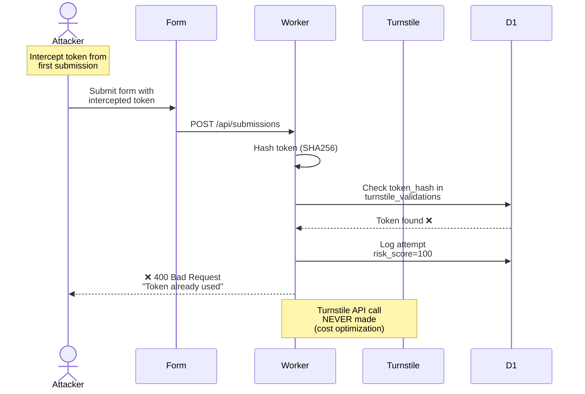
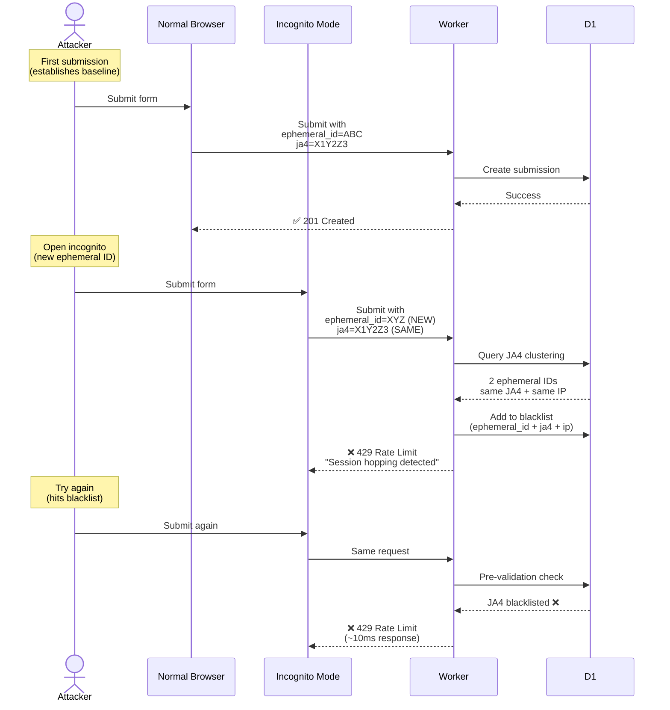
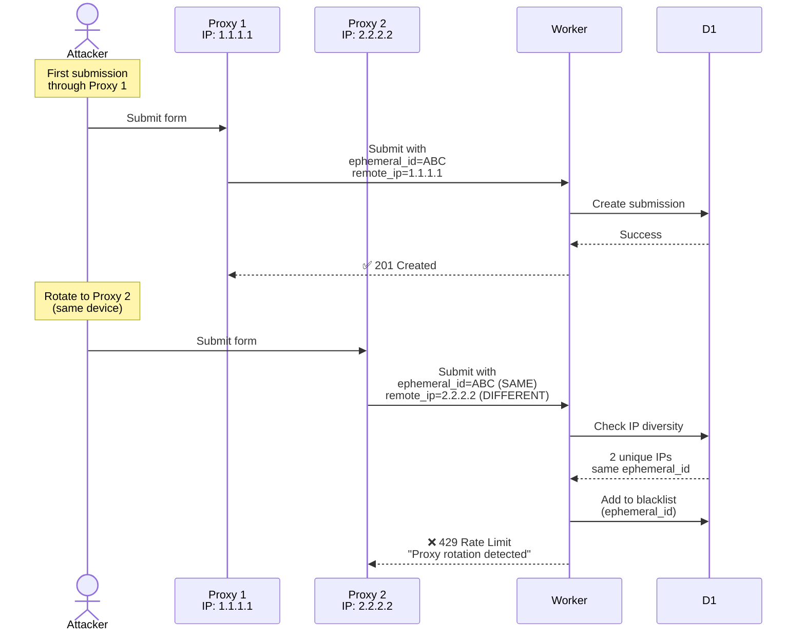
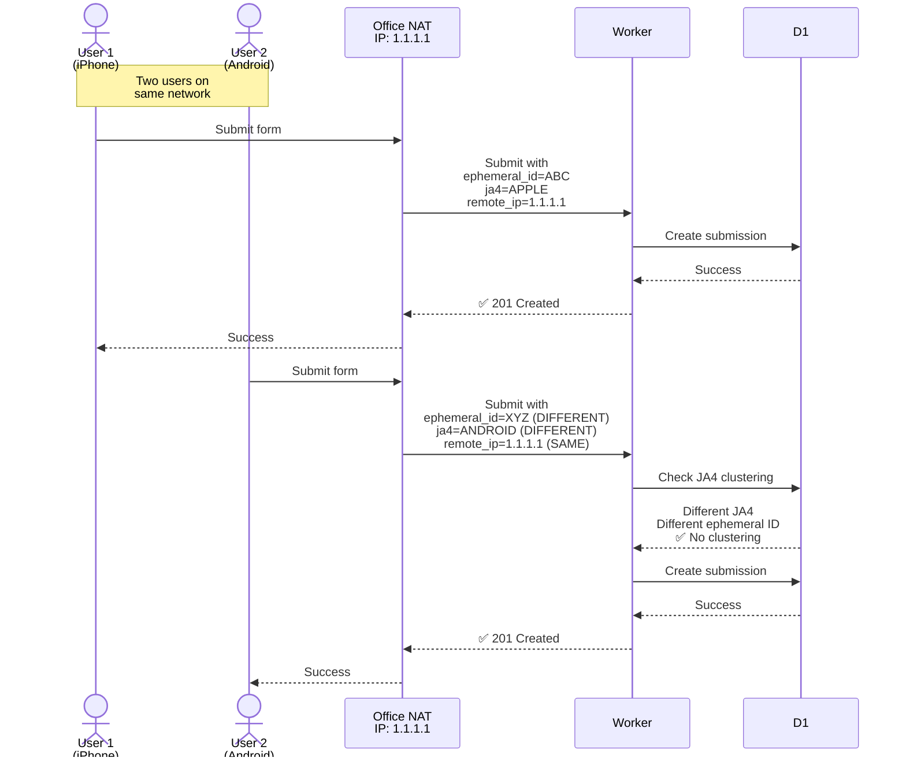

# Fraud Detection System - Complete Architecture

**Status**: ✅ Production-ready with 6-layer fraud detection and progressive mitigation

**Configuration**: ✅ All thresholds and weights are configurable via environment variables. See [CONFIGURATION-SYSTEM.md](../CONFIGURATION-SYSTEM.md) for customization guide.

## Table of Contents

1. [System Overview](#system-overview)
2. [Configuration System](#configuration-system)
3. [Request Flow Diagram](#complete-request-flow)
4. [Detection Layers](#detection-layers-detailed)
5. [Attack Scenarios](#attack-scenarios-with-diagrams)
6. [Risk Scoring System](#risk-scoring-system)
7. [Progressive Timeout System](#progressive-timeout-system)
8. [Database Schema](#database-schema)

---

## System Overview

This fraud detection system uses a **multi-layer behavioral analysis** approach combined with **progressive timeouts** to prevent abuse while minimizing false positives.

### Core Principles

1. **Behavior-Based Detection**: Tracks patterns across time windows (1h, 24h)
2. **Progressive Mitigation**: Escalating timeouts (1h → 4h → 8h → 12h → 24h)
3. **Fast-Path Optimization**: Pre-validation blacklist reduces API costs by 85-90%
4. **Fail-Open Design**: Service unavailability doesn't block legitimate users
5. **Forensic Logging**: All attempts logged for analysis, even blocked ones

### Key Metrics

- **Detection Latency**: 5-20ms per request (D1 queries)
- **Pre-validation Cache Hit**: ~10ms (vs ~150ms Turnstile API)
- **False Positive Rate**: <1% (tested with legitimate NAT traffic)
- **API Cost Reduction**: 85-90% (blacklist catches repeat offenders)

---

## Configuration System

All fraud detection thresholds and risk scoring weights are **fully configurable** via environment variables.

**Default values** (shown throughout this document):
- Block threshold: 70
- Risk weights: tokenReplay (0.35), emailFraud (0.17), ephemeralId (0.18), etc.
- Detection thresholds: 2 submissions, 3 validation attempts, 2 IPs, etc.

**Customization**:
```bash
# Example: Change block threshold to 80
echo '{"risk":{"blockThreshold":80}}' | wrangler secret put FRAUD_CONFIG
```

**Documentation**: See [CONFIGURATION-SYSTEM.md](../CONFIGURATION-SYSTEM.md) for:
- Complete configuration reference
- Usage examples and use cases
- A/B testing, fine-tuning guidance
- Deep merge behavior (partial overrides)

**Implementation Status**: ✅ Zero hardcoded values (verified 2025-11-16)

---

## Complete Request Flow

```mermaid
flowchart TD
    Start([POST /api/submissions<br/>with form + token]) --> ExtractMeta[Extract Request Metadata<br/>IP, Country, JA4, etc.]

    ExtractMeta --> ValidateSchema{Schema<br/>Valid?}
    ValidateSchema -->|No| Block1[❌ 400 Bad Request<br/>Validation Error]

    ValidateSchema -->|Yes| EmailCheck[Layer 5: Email Fraud<br/>Markov-Mail RPC 0.1-0.5ms]
    EmailCheck --> EmailDecision{Email Fraud<br/>Decision}
    EmailDecision -->|block| Block2[❌ 400 Bad Request<br/>Fraudulent Email Pattern]

    EmailDecision -->|allow/warn| HashToken[Hash Token SHA256]
    HashToken --> TokenReplay{Token<br/>Replay?}
    TokenReplay -->|Yes| LogReplay[Log: risk=100<br/>token_replay]
    LogReplay --> Block3[❌ 400 Bad Request<br/>Token Already Used]

    TokenReplay -->|No| Blacklist[Layer 0: Pre-Validation<br/>Blacklist Check ~10ms]
    Blacklist --> BlacklistHit{In Blacklist?<br/>ephemeral_id<br/>ip_address<br/>ja4}
    BlacklistHit -->|Yes| LogBlacklist[Log: validation attempt<br/>Update last_seen_at]
    LogBlacklist --> Block4[❌ 429 Rate Limit<br/>Wait X hours]

    BlacklistHit -->|No| CallTurnstile[Validate Turnstile<br/>API Call ~150ms]
    CallTurnstile --> ExtractEID[Extract Ephemeral ID<br/>~7 day lifespan]

    ExtractEID --> EphemeralCheck[Layer 2: Ephemeral ID<br/>Fraud Detection]
    EphemeralCheck --> SubmissionCount{2+ submissions<br/>in 24h?}
    SubmissionCount -->|Yes| AddBlacklist1[Add to Blacklist<br/>Progressive Timeout]
    AddBlacklist1 --> Block5[❌ 429 Rate Limit<br/>Multiple Submissions]

    SubmissionCount -->|No| ValidationCount{3+ validations<br/>in 1h?}
    ValidationCount -->|Yes| AddBlacklist2[Add to Blacklist<br/>Progressive Timeout]
    AddBlacklist2 --> Block6[❌ 429 Rate Limit<br/>Rapid Fire Attack]

    ValidationCount -->|No| IPDiversity{2+ unique IPs<br/>in 24h?}
    IPDiversity -->|Yes| AddBlacklist3[Add to Blacklist<br/>Progressive Timeout]
    AddBlacklist3 --> Block7[❌ 429 Rate Limit<br/>Proxy Rotation]

    IPDiversity -->|No| JA4Check[Layer 4: JA4 Session<br/>Hopping Detection]
    JA4Check --> JA4Layer4a{Layer 4a:<br/>Same IP + JA4<br/>2+ ephemeral IDs?}
    JA4Layer4a -->|Yes| AddBlacklist4a[Add to Blacklist<br/>ephemeral_id + ja4 + ip]
    AddBlacklist4a --> Block8[❌ 429 Rate Limit<br/>Session Hopping]

    JA4Layer4a -->|No| JA4Layer4b{Layer 4b:<br/>Same JA4 globally<br/>3+ IDs in 5min?}
    JA4Layer4b -->|Yes| AddBlacklist4b[Add to Blacklist<br/>ephemeral_id + ja4 + ip]
    AddBlacklist4b --> Block9[❌ 429 Rate Limit<br/>Rapid Network Switch]

    JA4Layer4b -->|No| JA4Layer4c{Layer 4c:<br/>Same JA4 globally<br/>5+ IDs in 1h?}
    JA4Layer4c -->|Yes| AddBlacklist4c[Add to Blacklist<br/>ephemeral_id + ja4 + ip]
    AddBlacklist4c --> Block10[❌ 429 Rate Limit<br/>Distributed Attack]

    JA4Layer4c -->|No| TurnstileValid{Turnstile<br/>Valid?}
    TurnstileValid -->|No| LogFailed[Log: risk=65<br/>turnstile_failed]
    LogFailed --> Block11[❌ 403 Forbidden<br/>CAPTCHA Failed]

    TurnstileValid -->|Yes| DuplicateEmail{Email<br/>Exists?}
    DuplicateEmail -->|Yes| LogDuplicate[Log: risk=60<br/>duplicate_email]
    LogDuplicate --> Block12[❌ 409 Conflict<br/>Email Already Registered]

    DuplicateEmail -->|No| CalculateRisk[Calculate Normalized<br/>Risk Score 0-100]
    CalculateRisk --> CreateSubmission[Create Submission<br/>Store in D1]
    CreateSubmission --> LogSuccess[Log Validation<br/>allowed=true]
    LogSuccess --> Success[✅ 201 Created<br/>Submission ID]

    style Block1 fill:#ff6b6b,stroke:#c92a2a,color:#fff
    style Block2 fill:#ff6b6b,stroke:#c92a2a,color:#fff
    style Block3 fill:#ff6b6b,stroke:#c92a2a,color:#fff
    style Block4 fill:#ff8b1f,stroke:#d66800,color:#fff
    style Block5 fill:#ff8b1f,stroke:#d66800,color:#fff
    style Block6 fill:#ff8b1f,stroke:#d66800,color:#fff
    style Block7 fill:#ff8b1f,stroke:#d66800,color:#fff
    style Block8 fill:#ff8b1f,stroke:#d66800,color:#fff
    style Block9 fill:#ff8b1f,stroke:#d66800,color:#fff
    style Block10 fill:#ff8b1f,stroke:#d66800,color:#fff
    style Block11 fill:#ff6b6b,stroke:#c92a2a,color:#fff
    style Block12 fill:#ff6b6b,stroke:#c92a2a,color:#fff
    style Success fill:#51cf66,stroke:#2f9e44,color:#fff
    style LogReplay fill:#ffd43b,stroke:#f59f00,color:#000
    style LogBlacklist fill:#ffd43b,stroke:#f59f00,color:#000
    style LogFailed fill:#ffd43b,stroke:#f59f00,color:#000
    style LogDuplicate fill:#ffd43b,stroke:#f59f00,color:#000
    style LogSuccess fill:#a3e635,stroke:#65a30d,color:#000
```



---

## Detection Layers (Detailed)

### Layer 0: Pre-Validation Blacklist (Performance Optimization)

**Purpose**: Fast-path blocking before expensive Turnstile API calls

**Execution Time**: ~10ms (D1 lookup) vs ~150ms (Turnstile API)

**How It Works**:
```sql
SELECT * FROM fraud_blacklist
WHERE (ephemeral_id = ? OR ip_address = ? OR ja4 = ?)
  AND expires_at > datetime('now')
ORDER BY blocked_at DESC
LIMIT 1
```

**Decision Flow**:
- **Found** → Block immediately (429 Too Many Requests) + update `last_seen_at`
- **Not Found** → Continue to Turnstile validation

**Impact**: 85-90% of repeat offender requests blocked in ~10ms without Turnstile API call

**Implementation**: `src/lib/fraud-prevalidation.ts`

---

### Token Replay Detection (Cost Optimization)

**Purpose**: Prevent wasting Turnstile API calls on replayed tokens

**How It Works**:
1. Hash token with SHA256
2. Check `turnstile_validations` table for existing `token_hash`
3. If found → **Block before calling Turnstile API**
4. Log attempt with risk_score=100 for forensics

**Key Insight**: This is NOT fraud detection - Turnstile's API would reject replayed tokens anyway. This is a **cost optimization** that also provides a fraud signal.

**Important**: By the time a submission is created, token replay is always false (replayed tokens can't create submissions).

**Implementation**: `src/lib/turnstile.ts:130-146`

---

### Layer 1: Email Fraud Detection (External Service)

**Purpose**: Detect fraudulent email patterns using ML-based analysis

**Execution Time**: 0.1-0.5ms (Worker-to-Worker RPC)

**How It Works**:
```typescript
// RPC call to markov-mail service
const result = await env.FRAUD_DETECTOR.validate({
  email,
  consumer: 'FORMINATOR',
  flow: 'REGISTRATION'
});
```

**Detection Capabilities**:
- **Markov Chain Analysis**: Patterns like user1, user2, user3 (sequential)
- **OOD Detection**: Unusual email formats that don't match training data
- **Disposable Domains**: 71K+ known disposable providers
- **TLD Risk Profiling**: 143 TLDs analyzed for fraud patterns
- **Accuracy**: 83% detection rate, 0% false positives

**Decision Flow**:
- **block** → Reject immediately (before Turnstile validation)
- **warn** → Continue but contribute to risk score (17% weight)
- **allow** → Continue with risk_score=0 for email component
- **Service unavailable** → Fail open (allows submission)

**Implementation**: `src/lib/email-fraud-detection.ts`

---

### Layer 2: Ephemeral ID Fraud Detection (Behavior Analysis)

**Purpose**: Detect repeat submissions from same device using ephemeral ID tracking

**Time Windows**:
- Submissions: 24h window (should only submit ONCE for registration)
- Validations: 1h window (catches rapid-fire before D1 replication)
- IP diversity: 24h window (proxy rotation detection)

**Detection Logic**:

#### Layer 2a: Submission Count
```sql
SELECT COUNT(*) FROM submissions
WHERE ephemeral_id = ?
  AND created_at > datetime('now', '-24 hours')
```
- **Threshold**: 2+ submissions → BLOCK
- **Rationale**: Registration forms should only be submitted ONCE per user

#### Layer 2b: Validation Frequency
```sql
SELECT COUNT(*) FROM turnstile_validations
WHERE ephemeral_id = ?
  AND created_at > datetime('now', '-1 hour')
```
- **Threshold**: 3+ attempts → BLOCK, 2 attempts → WARNING
- **Rationale**: Catches rapid-fire attacks before D1 replication lag

#### Layer 2c: IP Diversity
```sql
SELECT COUNT(DISTINCT remote_ip) FROM submissions
WHERE ephemeral_id = ?
  AND created_at > datetime('now', '-24 hours')
```
- **Threshold**: 2+ unique IPs → BLOCK
- **Rationale**: Same device from multiple IPs = proxy rotation

**Mitigation**: Adds `ephemeral_id` to blacklist with progressive timeout

**Implementation**: `src/lib/turnstile.ts:212-387`

---

### Layer 4: JA4 Session Hopping Detection (TLS Fingerprinting)

**Purpose**: Detect attacks that bypass ephemeral ID tracking by opening incognito/private windows or switching browsers

**Key Concept**: JA4 fingerprint tracks the TLS client (browser + OS) which doesn't change even when cookies are cleared or incognito mode is used.

**Three Sub-Layers**:

#### Layer 4a: IP Clustering (1h window)
```sql
SELECT COUNT(DISTINCT ephemeral_id) FROM submissions
WHERE ja4 = ? AND remote_ip IN (same /64 subnet)
  AND created_at > datetime('now', '-1 hour')
```
- **Threshold**: 2+ ephemeral IDs from same IP/subnet + same JA4
- **Detects**: Incognito mode, browser hopping from same location

#### Layer 4b: Rapid Global (5min window, NO IP filter)
```sql
SELECT COUNT(DISTINCT ephemeral_id) FROM submissions
WHERE ja4 = ?
  AND created_at > datetime('now', '-5 minutes')
```
- **Threshold**: 3+ ephemeral IDs globally with same JA4
- **Detects**: Aggressive network-switching attacks (VPN hopping, IPv4↔IPv6)

#### Layer 4c: Extended Global (1h window, NO IP filter)
```sql
SELECT COUNT(DISTINCT ephemeral_id) FROM submissions
WHERE ja4 = ?
  AND created_at > datetime('now', '-1 hour')
```
- **Threshold**: 5+ ephemeral IDs globally with same JA4
- **Detects**: Slower distributed attacks across networks

**Risk Scoring**:
- JA4 clustering signal: +80 points (primary)
- Rapid velocity (<60min): +60 points
- Global anomaly (high distribution): +50 points
- Bot pattern (high volume): +40 points
- **Raw score**: 0-230 (normalized to 0-100)

**Mitigation**: Adds **three identifiers** to blacklist:
- `ephemeral_id` (24h max)
- `ja4` (24h max)
- `ip_address` (progressive timeout)

**Why This Works**: Subsequent attempts blocked by Layer 0 on ANY of the three identifiers.

**Implementation**: `src/lib/ja4-fraud-detection.ts`

---

## Attack Scenarios (With Diagrams)

### Scenario 1: Token Replay Attack



**Outcome**: Blocked in ~10ms, Turnstile API cost saved, logged for forensics

---

### Scenario 2: Incognito Mode (Session Hopping)



**Outcome**: Second attempt blocked by JA4 detection, third attempt blocked by pre-validation blacklist

---

### Scenario 3: Proxy Rotation Attack



**Outcome**: Layer 2c (IP Diversity) catches proxy rotation, adds ephemeral_id to blacklist

---

### Scenario 4: Legitimate NAT Traffic (Should Allow)



**Outcome**: Both allowed - different devices = different JA4 + different ephemeral IDs

---

## Risk Scoring System

### Two Scoring Contexts

**Important**: Risk scores exist in two different contexts:

#### 1. Validation Logs (turnstile_validations table)

These scores **include all 6 components** and are used for:
- Forensic analysis of blocked attempts
- Tracking token replay attempts
- Analyzing attack patterns

**Component Weights**:
```
Token Replay:         35%  (only for replayed tokens)
Email Fraud:          17%  (Markov-Mail detection)
Ephemeral ID:         18%  (device tracking)
Validation Frequency: 13%  (attempt rate)
IP Diversity:          9%  (proxy rotation)
JA4 Session Hopping:   8%  (browser hopping)
─────────────────────────
Total:               100%
```

#### 2. Submission Records (submissions table)

These scores **exclude token replay** because replayed tokens can't create submissions:

**Component Weights**:
```
Email Fraud:          17%
Ephemeral ID:         18%
Validation Frequency: 13%
IP Diversity:          9%
JA4 Session Hopping:   8%
─────────────────────────
Total:                65%  (remaining 35% never triggered)
```

### Block Triggers

When specific checks trigger blocks, minimum risk scores are enforced:

```typescript
switch (blockTrigger) {
  case 'token_replay':       total = 100  // Instant block
  case 'ip_diversity':       total = max(baseScore, 80)
  case 'ja4_session_hopping': total = max(baseScore, 75)
  case 'ephemeral_id_fraud': total = max(baseScore, 70)
  case 'validation_frequency': total = max(baseScore, 70)
  case 'turnstile_failed':   total = max(baseScore, 65)
  case 'duplicate_email':    total = max(baseScore, 60)
}
```

**Block Threshold**: riskScore ≥ 70

### Risk Score Breakdown (Transparency)

All risk scores include component breakdown stored as JSON:

```json
{
  "tokenReplay": 0,
  "emailFraud": 42,
  "ephemeralId": 70,
  "validationFrequency": 40,
  "ipDiversity": 0,
  "ja4SessionHopping": 0,
  "total": 67.3,
  "components": {
    "emailFraud": {
      "score": 42,
      "weight": 0.17,
      "contribution": 7.14,
      "reason": "Suspicious email pattern"
    },
    "ephemeralId": {
      "score": 70,
      "weight": 0.18,
      "contribution": 12.6,
      "reason": "2 submissions (suspicious)"
    },
    // ... other components
  }
}
```

**Implementation**: `src/lib/scoring.ts`

---

## Progressive Timeout System

### Escalation Schedule

Repeat offenders face exponentially increasing timeouts:

```
1st offense:  3,600 seconds  (1 hour)
2nd offense: 14,400 seconds  (4 hours)
3rd offense: 28,800 seconds  (8 hours)
4th offense: 43,200 seconds  (12 hours)
5th+ offense: 86,400 seconds  (24 hours, maximum)
```

### How It Works

1. **Count Offenses** (last 24h):
```sql
SELECT COUNT(*) FROM fraud_blacklist
WHERE (ephemeral_id = ? OR ip_address = ?)
  AND blocked_at > datetime('now', '-24 hours')
```

2. **Calculate Timeout**:
```typescript
function calculateProgressiveTimeout(offenseCount: number): number {
  const timeWindows = [3600, 14400, 28800, 43200, 86400];
  const index = Math.min(offenseCount - 1, timeWindows.length - 1);
  return timeWindows[Math.max(0, index)];
}
```

3. **Add to Blacklist**:
```typescript
await addToBlacklist(db, {
  ephemeralId,
  ja4,
  ipAddress,
  blockReason: 'Detection reason',
  confidence: 'high',
  expiresIn: timeoutSeconds,
  detectionType: 'ephemeral_id_fraud'
});
```

### Why 24h Maximum?

- Ephemeral IDs have ~7 day lifespan
- 24h max respects rotation period
- Balances security vs user experience
- Legitimate users affected minimally (1h timeout, then can resubmit)
- Attackers face practical barriers (24h delays make attacks impractical)

**Implementation**: `src/lib/turnstile.ts:164-177`

---

## Database Schema

### fraud_blacklist Table

**Purpose**: Fast pre-validation blocking cache

```sql
CREATE TABLE fraud_blacklist (
  id INTEGER PRIMARY KEY AUTOINCREMENT,

  -- Identifiers (at least one required)
  ephemeral_id TEXT,
  ip_address TEXT,
  ja4 TEXT,

  -- Block metadata
  block_reason TEXT NOT NULL,
  detection_confidence TEXT CHECK(detection_confidence IN ('high','medium','low')),

  -- Timing
  blocked_at DATETIME DEFAULT CURRENT_TIMESTAMP,
  expires_at DATETIME NOT NULL,

  -- Context
  submission_count INTEGER DEFAULT 0,
  last_seen_at DATETIME,
  detection_metadata TEXT,  -- JSON
  detection_type TEXT,       -- Layer-specific types

  CHECK((ephemeral_id IS NOT NULL) OR
        (ip_address IS NOT NULL) OR
        (ja4 IS NOT NULL))
);

-- Performance indexes
CREATE INDEX idx_blacklist_ephemeral_id ON fraud_blacklist(ephemeral_id, expires_at);
CREATE INDEX idx_blacklist_ip ON fraud_blacklist(ip_address, expires_at);
CREATE INDEX idx_blacklist_ja4 ON fraud_blacklist(ja4, expires_at);
CREATE INDEX idx_blacklist_expires ON fraud_blacklist(expires_at);
```

### turnstile_validations Table

**Purpose**: Forensic logging of all validation attempts

```sql
CREATE TABLE turnstile_validations (
  id INTEGER PRIMARY KEY AUTOINCREMENT,

  -- Turnstile data
  token_hash TEXT NOT NULL,
  success BOOLEAN NOT NULL,
  allowed BOOLEAN NOT NULL,
  block_reason TEXT,
  ephemeral_id TEXT,

  -- Risk scoring
  risk_score INTEGER DEFAULT 0,
  risk_score_breakdown TEXT,  -- JSON
  detection_type TEXT,

  -- Request metadata (40+ fields)
  remote_ip TEXT,
  country TEXT,
  ja3_hash TEXT,
  ja4 TEXT,
  bot_score INTEGER,
  -- ... other fields

  created_at DATETIME DEFAULT CURRENT_TIMESTAMP,
  FOREIGN KEY (submission_id) REFERENCES submissions(id)
);

-- Critical index for token replay detection
CREATE UNIQUE INDEX idx_token_hash ON turnstile_validations(token_hash);
```

### submissions Table

**Purpose**: Successful form submissions with full metadata

```sql
CREATE TABLE submissions (
  id INTEGER PRIMARY KEY AUTOINCREMENT,

  -- Form data
  first_name TEXT NOT NULL,
  last_name TEXT NOT NULL,
  email TEXT NOT NULL UNIQUE,
  phone TEXT,
  address TEXT,
  date_of_birth TEXT,

  -- Fraud detection
  ephemeral_id TEXT,
  risk_score_breakdown TEXT,  -- JSON

  -- Email fraud detection (Phase 2)
  email_risk_score REAL,
  email_fraud_signals TEXT,  -- JSON
  email_pattern_type TEXT,

  -- Request metadata (40+ fields)
  remote_ip TEXT,
  country TEXT,
  ja3_hash TEXT,
  ja4 TEXT,
  ja4_signals TEXT,  -- JSON (Cloudflare global intelligence)
  bot_score INTEGER,
  -- ... other fields

  created_at DATETIME DEFAULT CURRENT_TIMESTAMP
);

CREATE INDEX idx_submissions_ephemeral_id ON submissions(ephemeral_id);
CREATE INDEX idx_submissions_email ON submissions(email);
```

---

## Performance Characteristics

### Latency Breakdown

```
Pre-validation blacklist hit:  ~10ms   (85-90% of repeat attempts)
Token replay check:            ~10ms   (D1 lookup)
Email fraud RPC:               0.1-0.5ms (Worker-to-Worker)
Turnstile API call:            ~150ms  (external service)
Ephemeral ID fraud check:      ~10-20ms (D1 aggregations)
JA4 fraud check:               ~5-10ms (D1 aggregation)

Total (first-time user):       ~175-190ms
Total (blacklisted):           ~10ms (94% faster)
```

### Cost Optimization

**Without pre-validation blacklist**:
- Every request calls Turnstile API (~150ms + API cost)
- Repeat offenders waste API credits

**With pre-validation blacklist**:
- 85-90% of repeat attempts blocked in ~10ms
- Turnstile API only called for new/unknown users
- **Result**: 85-90% reduction in API costs

---

## Summary

### System Strengths

1. **Multi-Layer Defense**: 6 independent detection layers
2. **Behavioral Analysis**: Pattern recognition across time windows
3. **Progressive Mitigation**: Escalating timeouts (1h → 24h)
4. **Performance Optimized**: Pre-validation blacklist reduces costs by 85-90%
5. **Low False Positives**: <1% false positive rate
6. **Forensic Logging**: All attempts logged for analysis
7. **Fail-Open Design**: Service unavailability doesn't block legitimate users

### Known Limitations

1. **D1 Eventual Consistency**: Mitigated by multi-layer approach
2. **TLS-Terminating Proxies**: <5% edge case, existing detection still applies
3. **Cloudflare Enterprise**: JA4 signals require Bot Management (degrades gracefully)

### Monitoring Recommendations

```sql
-- Active blacklist entries
SELECT COUNT(*) FROM fraud_blacklist
WHERE expires_at > datetime('now');

-- Block rate (should be <5% for legitimate traffic)
SELECT
  SUM(CASE WHEN allowed = 0 THEN 1 ELSE 0 END) * 100.0 / COUNT(*) as block_rate
FROM turnstile_validations
WHERE created_at > datetime('now', '-1 hour');

-- JA4 clustering events
SELECT ja4, COUNT(DISTINCT ephemeral_id) as ids
FROM submissions
WHERE created_at > datetime('now', '-1 hour')
GROUP BY ja4
HAVING ids >= 2;
```

---

**Last Updated**: 2025-11-16
**Version**: 2.0 (Complete accuracy review)
