# Fraud Detection System

## Table of Contents

1. [System Overview](#system-overview)
2. [Configuration](#configuration)
3. [Complete Request Flow](#complete-request-flow)
4. [Detection Layers](#detection-layers)
5. [Attack Scenarios](#attack-scenarios)
6. [Risk Scoring System](#risk-scoring-system)
7. [Progressive Timeout System](#progressive-timeout-system)
8. [Database Schema](#database-schema)
9. [Performance Characteristics](#performance-characteristics)

---

## System Overview

The fraud detection system uses multi-layer behavioral analysis combined with progressive timeouts to prevent abuse while minimizing false positives.

### Implementation Approach

- Behavior-based detection tracking patterns across time windows (1h, 24h)
- Progressive mitigation with escalating timeouts (1h → 4h → 8h → 12h → 24h)
- Fast-path optimization using pre-validation blacklist
- Fail-open design for service unavailability
- Forensic logging of all attempts for analysis

---

## Configuration

All fraud detection thresholds and risk scoring weights are configurable via environment variables. See [CONFIGURATION-SYSTEM.md](./CONFIGURATION-SYSTEM.md) for:

- Complete configuration reference
- Usage examples and use cases
- A/B testing and fine-tuning guidance
- Deep merge behavior for partial overrides

Default thresholds referenced throughout this document can be customized via the `FRAUD_CONFIG` environment variable.

---

## Complete Request Flow


---

## Detection Layers

### Logging vs Mitigation Tables

The system uses two complementary tables for fraud management:

#### fraud_blocks (Forensic Logging Only)

**Purpose**: Analytics and forensic investigation

- **Logs**: Pre-Turnstile fraud blocks (email fraud, IP reputation, etc.)
- **No Caching**: Each attempt logged independently
- **Use Case**: Analytics dashboard, pattern analysis, investigation
- **Query Performance**: Not indexed for fast lookup (not in hot path)
- **Table Structure** (`schema.sql:141-164`):
  - Detection metadata (detection_type, block_reason, risk_score)
  - Email fraud signals (pattern_type, markov_detected, ood_detected, etc.)
  - Request metadata (IP, country, user agent)
  - Full JSON snapshots for comprehensive analysis

#### fraud_blacklist (Mitigation Cache)

**Purpose**: High-performance repeat prevention

- **Blocks**: Repeat offenders with progressive timeouts
- **Fast Lookup**: Indexed for ~10ms pre-validation checks
- **Use Case**: Layer 0 fast-path blocking (85-90% API call reduction)
- **Query Performance**: Heavily indexed (ephemeral_id, ip_address, ja4, expires_at)
- **Table Structure** (`schema.sql:112-135`):
  - Multiple identifiers (ephemeral_id, ip_address, ja4)
  - Progressive timeouts (expires_at with escalation)
  - Offense tracking (submission_count, offense history)
  - Minimal metadata (optimized for speed)

**Key Difference**:

```
fraud_blocks:     Complete forensic record  →  Analytics visibility
fraud_blacklist:  Fast mitigation cache     →  Performance optimization
```

**When Both Are Used**:

Most fraud detection layers (ephemeral ID, JA4 session hopping) add to **both tables**:
1. Write to `fraud_blacklist` → Future attempts blocked quickly
2. Write to `fraud_blocks` OR `turnstile_validations` → Forensic record

Email fraud detection follows this pattern with email-based blacklisting.

---

### Layer 0: Pre-Validation Blacklist

Fast-path blocking before expensive Turnstile API calls.

**Implementation** (`src/lib/fraud-prevalidation.ts`):

```sql
SELECT * FROM fraud_blacklist
WHERE (ephemeral_id = ? OR ip_address = ? OR ja4 = ?)
  AND expires_at > datetime('now')
ORDER BY blocked_at DESC
LIMIT 1
```

**Decision Flow**:
- Found → Block immediately (429 Too Many Requests) + update `last_seen_at`
- Not Found → Continue to Turnstile validation

Most repeat offender requests blocked without Turnstile API call.

---

### Token Replay Detection

Prevents wasting Turnstile API calls on replayed tokens.

**Implementation** (`src/lib/turnstile.ts:130-146`):

1. Hash token with SHA256
2. Check `turnstile_validations` table for existing `token_hash`
3. If found → Block before calling Turnstile API
4. Log attempt with risk_score=100 for forensics

Cost optimization: Turnstile's API would reject replayed tokens anyway, but this blocks earlier to save API costs.

Replayed tokens cannot create submissions, so this only appears in validation logs.

---

### Layer 0.5: IP Rate Limiting (Behavioral Signal)

IP-based behavioral signal detecting browser-switching attacks.

**Philosophy**: Behavioral signal, not hard block
- Contributes 7% to total risk score
- Combined with other signals for holistic decision
- Prevents false positives from shared IPs (offices, universities)

**Use Case**: Attacker switches browsers to get new fingerprints:
- Attempt 1: Firefox → ephemeral_id=A, ja4=Firefox
- Attempt 2: Chrome → ephemeral_id=B, ja4=Chrome (different fingerprints)
- Attempt 3: Safari → ephemeral_id=C, ja4=Safari (bypasses Layers 2 & 4)
- **Detection**: IP signal = 50% risk (3 submissions from same IP)

**Implementation** (`src/lib/ip-rate-limiting.ts`):

```typescript
export async function collectIPRateLimitSignals(
  remoteIp: string,
  db: D1Database,
  config: FraudDetectionConfig
): Promise<IPRateLimitSignals> {
  // Count submissions from this IP (ANY ephemeral_id, ANY JA4)
  const result = await db
    .prepare(`
      SELECT COUNT(*) as count
      FROM submissions
      WHERE remote_ip = ?
      AND created_at > datetime('now', '-1 hour')
    `)
    .bind(remoteIp)
    .first<{ count: number }>();

  const submissionCount = result?.count || 0;
  const effectiveCount = submissionCount + 1;

  // Non-linear risk scoring: 1→0%, 2→25%, 3→50%, 4→75%, 5+→100%
  let riskScore: number;
  if (effectiveCount === 1) riskScore = 0;
  else if (effectiveCount === 2) riskScore = 25;
  else if (effectiveCount === 3) riskScore = 50;
  else if (effectiveCount === 4) riskScore = 75;
  else riskScore = 100;

  return { submissionCount: effectiveCount, riskScore, warnings };
}
```

**Configuration**:
```typescript
detection: {
  ipRateLimitThreshold: 3,    // For risk curve
  ipRateLimitWindow: 3600,    // 1 hour
}
risk: {
  weights: {
    ipRateLimit: 0.07  // 7% weight
  }
}
```

**Why Behavioral Signal > Hard Block**:

Scenario 1 (Office - Legitimate):
```
IP: 3 submissions (50% × 7% = 3.5%)
Email: 3 different domains (0%)
Total: 4% → ✅ ALLOWED
```

Scenario 2 (Attack - Fraud Patterns):
```
IP: 3 submissions (50% × 7% = 3.5%)
Email: Sequential (80% × 14% = 11.2%)
Ephemeral: 2 submissions (100% × 15% = 15%)
Total: 34%+ → Combined signals → 75% → 🚫 BLOCKED
```

**Note**: IP rate limit is NOT a blockTrigger on its own. It contributes to risk score but doesn't trigger blocks independently, preventing false positives from shared IPs.

---

### Layer 1: Email Fraud Detection

ML-based email pattern analysis using external service.

**Execution Time**: 0.1-0.5ms (Worker-to-Worker RPC)

**Implementation** (`src/lib/email-fraud-detection.ts`):

```typescript
const result = await env.FRAUD_DETECTOR.validate({
  email,
  consumer: 'FORMINATOR',
  flow: 'REGISTRATION'
});
```

**Detection Capabilities**:
- Markov Chain pattern analysis (sequential: user1, user2, user3)
- Out-of-Distribution (OOD) detection for unusual formats
- Disposable domain detection (71K+ domains)
- TLD risk profiling (143 TLDs analyzed)

**Decision Flow**:
- `block` → Reject immediately (before Turnstile validation)
- `warn` → Continue but contribute to risk score (15% weight)
- `allow` → Continue with risk_score=0 for email component
- Service unavailable → Fail open (allows submission)

**Mitigation** (`src/routes/submissions.ts:165-183`):

When email fraud is detected (`decision='block'`):
1. **Logs to `fraud_blocks` table** - Forensic logging for analytics
2. **Adds to `fraud_blacklist` table** - IP-based blacklist for repeat prevention
   - Timeout: 1 hour (first offense)
   - Identifier: IP address (ephemeral_id not available yet)
   - Subsequent attempts blocked by Layer 0 (pre-validation blacklist)

**Performance Impact**: Repeat attempts with fraudulent emails hit the fast blacklist path (~10ms) instead of requiring Markov-Mail RPC (~150ms), reducing load on the fraud detection service.

---

### Layer 2: Ephemeral ID Fraud Detection

Behavioral analysis detecting repeat submissions from same device.

**Time Windows**:
- Submissions: 24h (registration forms typically submit once)
- Validations: 1h (catches rapid-fire before D1 replication)
- IP diversity: 24h (proxy rotation detection)

**Implementation** (`src/lib/turnstile.ts:212-387`):

#### Layer 2a: Submission Count

```sql
SELECT COUNT(*) FROM submissions
WHERE ephemeral_id = ?
  AND created_at > datetime('now', '-24 hours')
```

Threshold: 2+ submissions → Block (registration forms typically submitted once per user)

#### Layer 2b: Validation Frequency

```sql
SELECT COUNT(*) FROM turnstile_validations
WHERE ephemeral_id = ?
  AND created_at > datetime('now', '-1 hour')
```

Threshold: 3+ attempts → Block, 2 attempts → Warning (catches rapid-fire attacks before D1 replication lag)

#### Layer 2c: IP Diversity

```sql
SELECT COUNT(DISTINCT remote_ip) FROM submissions
WHERE ephemeral_id = ?
  AND created_at > datetime('now', '-24 hours')
```

Threshold: 2+ unique IPs → Block (same device from multiple IPs indicates proxy rotation)

Mitigation: Adds `ephemeral_id` to blacklist with progressive timeout.

### Duplicate Email Guard (Layer 2.5)

- Runs immediately after Layer 2 signals, using the sanitized email plus IP/JA4 fingerprints.
- First duplicate attempt returns HTTP 409 (no timeout) so legitimate users can correct mistakes.
- The second attempt within 24h is recorded in `fraud_blacklist` (`detection_confidence = 'low'`) but still returns 409.
- The third attempt escalates to a high-confidence blacklist entry with a progressive timeout (1h → 4h → 8h → 12h → 24h) and responds with HTTP 429.
- Every entry captures `email`, `ip_address`, `ja4`, optional `ephemeral_id`, and `erfid` so analytics can highlight abuse patterns.
- Centralizes duplicate detection without relying on database UNIQUE constraints (which only catch writes and lack rate-limit context).

---

### Layer 4: JA4 Session Hopping Detection

TLS fingerprinting to detect attacks bypassing ephemeral ID tracking by opening incognito/private windows or switching browsers.

JA4 fingerprint tracks the TLS client (browser + OS) which doesn't change when cookies are cleared or incognito mode is used.
Only **new** ephemeral IDs observed in the query window count toward the clustering thresholds—reusing the same Turnstile session no longer increments the total, so legitimate users resubmitting from the same tab won't be flagged as “two fingerprints.”

**Implementation** (`src/lib/ja4-fraud-detection.ts`):

#### Layer 4a: IP Clustering (1h window)

```sql
SELECT COUNT(DISTINCT ephemeral_id) FROM submissions
WHERE ja4 = ? AND remote_ip IN (same /64 subnet)
  AND created_at > datetime('now', '-1 hour')
```

**Threshold**: 2+ ephemeral IDs from same IP/subnet + same JA4

**Detection**: Multi-signal risk scoring:
- Analyzes three detection layers (4a: IP clustering, 4b: rapid global, 4c: extended global)
- Calculates composite score from 4 signals:
  - Clustering (+80 points)
  - Velocity (<10 min apart: +60 points)
  - Global anomaly (+50 points)
  - Bot pattern (+40 points)
- Raw score contributes to holistic risk assessment
- Combined with other signals (email, ephemeral ID, etc.) for blocking decision

**Examples**:
- **Family/Office**: 2 users, Chrome, 30 min apart → Score ~57 → **ALLOW**
- **Attack**: 2 users, Chrome, 2 min apart → Score ~87 → **BLOCK**

**Feature Flag**: `useRiskScoreThreshold` (default: true)
- `true`: Use multi-signal risk scoring (reduces false positives)
- `false`: Block immediately when count threshold reached (old behavior)

Detects: Incognito mode, browser hopping from same location

#### Layer 4b: Rapid Global (5min window, no IP filter)

```sql
SELECT COUNT(DISTINCT ephemeral_id) FROM submissions
WHERE ja4 = ?
  AND created_at > datetime('now', '-5 minutes')
```

**Threshold**: 3+ ephemeral IDs globally with same JA4

**Detection**: Same multi-signal risk scoring as Layer 4a (blocks only if score ≥ 70)

Detects: Aggressive network-switching attacks (VPN hopping, IPv4↔IPv6)

#### Layer 4c: Extended Global (1h window, no IP filter)

```sql
SELECT COUNT(DISTINCT ephemeral_id) FROM submissions
WHERE ja4 = ?
  AND created_at > datetime('now', '-1 hour')
```

**Threshold**: 5+ ephemeral IDs globally with same JA4

**Detection**: Same multi-signal risk scoring as Layer 4a (blocks only if score ≥ 70)

Detects: Slower distributed attacks across networks

**Risk Scoring**:
- JA4 clustering signal: +80 points (primary)
- Rapid velocity (<10min): +60 points (configurable: `velocityThresholdMinutes`)
- Global anomaly (high distribution): +50 points
- Bot pattern (high volume): +40 points
- Raw score: 0-230 contributes to holistic risk assessment
- Holistic block threshold: ≥70 (configurable: `risk.blockThreshold`)

**Mitigation**: Adds three identifiers to blacklist:
- `ephemeral_id` (24h max)
- `ja4` (24h max)
- `ip_address` (progressive timeout)

Subsequent attempts blocked by Layer 0 on any of the three identifiers.

#### JA4 Signals Intelligence

Cloudflare provides **global intelligence** about each JA4 fingerprint through `request.cf.botManagement.ja4Signals`. These signals represent aggregated data across Cloudflare's entire network in the last hour, providing context about whether a fingerprint is legitimate (popular browser) or suspicious (bot/proxy network).

**Available Signals** (10 signals from `src/lib/ja4-fraud-detection.ts:32-53`):

| Signal | Type | Description | Fraud Indicator |
|--------|------|-------------|----------------|
| `ips_quantile_1h` | Quantile (0-1) | Rank by unique IP count globally | >0.95 = high IP diversity (proxy/bot network) |
| `ips_rank_1h` | Rank | Absolute rank by unique IPs | Lower number = more IPs |
| `reqs_quantile_1h` | Quantile (0-1) | Rank by request volume globally | >0.99 = very high volume (bot network) |
| `reqs_rank_1h` | Rank | Absolute rank by request volume | Lower number = more requests |
| `heuristic_ratio_1h` | Ratio (0-1) | Flagged by CF heuristics | >0.8 = bot-like behavior |
| `browser_ratio_1h` | Ratio (0-1) | Browser-like requests | <0.2 = likely automation |
| `h2h3_ratio_1h` | Ratio (0-1) | HTTP/2 or HTTP/3 requests | >0.9 = modern browser |
| `cache_ratio_1h` | Ratio (0-1) | Cacheable responses | Higher = more static content |
| `uas_rank_1h` | Rank | User agent diversity | Lower = more diverse UAs |
| `paths_rank_1h` | Rank | Path diversity | Lower = more diverse paths |

**Active Detection Signals** (used in fraud scoring):

1. **IP Diversity (Global)**: `ips_quantile_1h > 0.95`
   - **Legitimate**: Popular browsers (Chrome, Firefox) have high IP diversity
   - **Suspicious**: Bot networks also show high IP diversity, BUT combined with local clustering triggers detection
   - **Detection**: High global diversity + local IP clustering = proxy/bot network
   - **Threshold**: Configurable via `config.ja4.ipsQuantileThreshold` (default: 0.95)

2. **Request Volume (Global)**: `reqs_quantile_1h > 0.99`
   - **Legitimate**: Popular browsers generate high request volume
   - **Suspicious**: Bot networks generate extreme volume
   - **Detection**: High volume + rapid local submissions = bot pattern
   - **Threshold**: Configurable via `config.ja4.reqsQuantileThreshold` (default: 0.99)

**Monitoring Signals** (captured but not used for blocking):

- **Heuristic Ratio**: Cloudflare's internal bot detection
- **Browser Ratio**: Indicates legitimate browser traffic
- **H2H3 Ratio**: Modern browser indicator (HTTP/2/3 support)
- **Cache Ratio**: Content access patterns
- **UA/Path Ranks**: Diversity indicators

**Why Not Use All Signals?**

The system uses only **2 signals** (IP diversity + request volume) to avoid false positives:

- **Problem**: Popular browsers (Chrome) can have "suspicious" characteristics:
  - High IP diversity (millions of users globally)
  - High request volume (popular browser)
  - These alone don't indicate fraud

- **Solution**: Combine global signals with **local behavior**:
  - High global IP diversity **ALONE** ≠ fraud
  - High global IP diversity **+ same IP submitting multiple times** = fraud
  - This distinguishes "popular browser" from "proxy/bot network"

**Implementation** (`src/lib/ja4-fraud-detection.ts:393-420`):

```typescript
// Parse JA4 signals from Cloudflare
const ja4Signals = parseJA4Signals(row.ja4_signals);

// Global anomaly detection
const signalAnalysis: SignalAnalysis = {
  highGlobalDistribution:
    ja4Signals.ips_quantile_1h !== null &&
    ja4Signals.ips_quantile_1h > config.ja4.ipsQuantileThreshold,
  highRequestVolume:
    ja4Signals.reqs_quantile_1h !== null &&
    ja4Signals.reqs_quantile_1h > config.ja4.reqsQuantileThreshold,
  ipsQuantile: ja4Signals.ips_quantile_1h ?? null,
  reqsQuantile: ja4Signals.reqs_quantile_1h ?? null,
};

// Risk scoring
if (signalAnalysis.highGlobalDistribution &&
    signalAnalysis.highRequestVolume) {
  riskScore += 50; // Both signals = bot network
} else if (signalAnalysis.highGlobalDistribution ||
           signalAnalysis.highRequestVolume) {
  riskScore += 40; // One signal = suspicious
}
```

### Extended Request Fingerprints (Phase 4)

The worker now captures a **header + TLS snapshot** for every request and stores it in the new `request_headers` and `extended_metadata` columns (see `schema.sql`). This supplements the 40+ Cloudflare fields with:

- **HTTP client hints**: `sec-ch-ua*`, `sec-fetch-*`, HTTP/2 `priority`, DNT, Accept-Language/Encoding, etc.
- **Header fingerprint**: deterministic FNV-1a hash of all non-sensitive headers so automation frameworks can be clustered even when JA4/ephemeral IDs rotate.
- **TLS internals**: ClientHello length, ClientRandom, TLS extension SHA-1 digests, exported authenticator, and mutual TLS metadata. These survive beyond `ja4` strings and expose mismatched handshakes.
- **Transport context**: `cf-ray`, `deviceType`, `clientTcpRtt`, `edgeRequestKeepAliveStatus`, and Cloudflare `requestPriority` for POP-level forensics.

**How to use it**

1. **Analytics pivots** – Query the JSON blobs to group submissions by header order, language mismatch, or TLS digest when hunting one-off attacks.
2. **Future rules** – Combine with existing scoring (e.g., flag `sec-ch-ua-platform="Windows"` + mobile TLS hashes, or <5 ms RTT + residential ASN claims).
3. **Downstream services** – The same metadata blob is serialized through `logValidation`/`createSubmission`, so Markov-Mail and analytics APIs can consume identical fingerprints without re-ingesting the request.

This keeps Cloudflare’s own scores as advisory signals while giving you the raw material to fingerprint the very first attempt from a new attacker.

### Fingerprint Signals Hooked Into Scoring

Phase 4.5 pipes the raw telemetry above directly into the runtime scorer via `collectFingerprintSignals()`:

- **Header fingerprint reuse** → `risk.weights.headerFingerprint` (default 7%). Triggers when the same sanitized header stack appears across multiple JA4 fingerprints and IPs within 60 minutes.
- **TLS fingerprint anomaly** → `risk.weights.tlsAnomaly` (default 4%). Fires when a JA4 presents a TLS extension hash not seen in the last 24 hours (with ≥5 known-good baselines).
- **Latency mismatch** → `risk.weights.latencyMismatch` (default 2%). Flags “mobile” claims with sub-6 ms RTTs from desktop device types or data-center ASNs **only when Cloudflare reports a non-zero `clientTcpRtt`**. Missing/zero RTT readings are treated as “unknown” and do not score the request.

When any of these heuristics return a non-zero score they add weight to the holistic risk score; if they exceed the block threshold they now populate `blockTrigger` (`header_fingerprint`, `tls_anomaly`, `latency_mismatch`) so blacklist entries and analytics surfaces show the root cause.

All safe combinations (header fingerprints, JA4+TLS hashes) are cached in the new `fingerprint_baselines` table. Known-good pairs refresh their `last_seen` timestamp automatically so the collector can skip redundant lookups, while unknown combos keep flowing through the anomaly logic.

**Frontend Display** (`frontend/src/components/analytics/JA4SignalsDetail.tsx`):

The analytics dashboard displays all 10 signals with:
- **Active Detection Signals**: Highlighted with thresholds and risk indicators
- **Behavioral Signals**: Monitored for visibility but not used for blocking
- **Color coding**: Red (risky), yellow (warning), green (normal)
- **Explanations**: Tooltips explaining what each signal means

**Configuration** (via `FRAUD_CONFIG` environment variable):

```json
{
  "ja4": {
    "ipsQuantileThreshold": 0.95,
    "reqsQuantileThreshold": 0.99,
    "heuristicRatioThreshold": 0.8,
    "browserRatioThreshold": 0.2,
    "h2h3RatioThreshold": 0.9,
    "cacheRatioThreshold": 0.5
  }
}
```

**Key Principle**: JA4 signals provide **context**, not definitive fraud indicators. They're most powerful when combined with local clustering patterns (Layer 4a/4b/4c).

#### Firefox Private Browsing & JA4 Stability

**Research Question**: Does Firefox change JA4 in private browsing mode?

**Finding**: JA4 should **remain stable** across normal and private modes.

**Evidence**:
- Firefox enables `security.ssl.disable_session_identifiers = true` in private mode
- This changes **JA3** fingerprint (includes session ID)
- JA4 **excludes session ID** from fingerprinting (per specification)
- Therefore, JA4 should stay the same across browsing modes

**Verification Status**: Theoretical (based on JA4 spec) - empirical testing recommended

**System Impact**:
- **If JA4 stable** (expected): Layer 4 catches Firefox incognito hopping
- **If JA4 changes** (unlikely): Layer 0.5 (IP rate limit) catches it
- **Verdict**: System is robust either way

**Market Share**: Firefox ~10% (~500M users) - not an edge case, but covered by dual-layer approach.

**References**:
- [JA4 Technical Specification](https://github.com/FoxIO-LLC/ja4/blob/main/technical_details/JA4.md)
- [Firefox Session ID Issue (arkenfox)](https://github.com/arkenfox/user.js/issues/1838)

---

## Attack Scenarios

### Scenario 1: Token Replay Attack


Outcome: Blocked without calling Turnstile API, logged for forensics.

---

### Scenario 2: Incognito Mode (Session Hopping)


Outcome: Second attempt blocked by JA4 detection, third attempt blocked by pre-validation blacklist.

---

### Scenario 3: Proxy Rotation Attack

```mermaid
sequenceDiagram
    actor Attacker
    participant Proxy1 as Proxy 1<br/>IP: 1.1.1.1
    participant Proxy2 as Proxy 2<br/>IP: 2.2.2.2
    participant Worker
    participant D1

    Note over Attacker: First submission<br/>through Proxy 1
    Attacker->>Proxy1: Submit form
    Proxy1->>Worker: Submit with<br/>ephemeral_id=ABC<br/>remote_ip=1.1.1.1
    Worker->>D1: Create submission
    D1-->>Worker: Success
    Worker-->>Proxy1: ✅ 201 Created

    Note over Attacker: Rotate to Proxy 2<br/>(same device)
    Attacker->>Proxy2: Submit form
    Proxy2->>Worker: Submit with<br/>ephemeral_id=ABC (SAME)<br/>remote_ip=2.2.2.2 (DIFFERENT)
    Worker->>D1: Check IP diversity
    D1-->>Worker: 2 unique IPs<br/>same ephemeral_id
    Worker->>D1: Add to blacklist<br/>(ephemeral_id)
    Worker-->>Proxy2: ❌ 429 Rate Limit<br/>"Proxy rotation detected"
```



Outcome: Layer 2c (IP Diversity) catches proxy rotation, adds ephemeral_id to blacklist.

---

### Scenario 4: Browser Switching Attack

```mermaid
sequenceDiagram
    actor Attacker
    participant Firefox
    participant Chrome
    participant Safari
    participant Worker
    participant D1

    Note over Attacker: First submission<br/>with Firefox
    Attacker->>Firefox: Submit form
    Firefox->>Worker: Submit with<br/>ephemeral_id=A<br/>ja4=Firefox_JA4<br/>remote_ip=1.1.1.1
    Worker->>D1: Create submission
    D1-->>Worker: Success
    Worker-->>Firefox: ✅ 201 Created

    Note over Attacker: Switch to Chrome<br/>(different fingerprints)
    Attacker->>Chrome: Submit form
    Chrome->>Worker: Submit with<br/>ephemeral_id=B (NEW)<br/>ja4=Chrome_JA4 (NEW)<br/>remote_ip=1.1.1.1 (SAME)
    Worker->>D1: Check ephemeral ID fraud
    D1-->>Worker: Different ephemeral_id ✓
    Worker->>D1: Check JA4 hopping
    D1-->>Worker: Different JA4 ✓
    Worker->>D1: Check IP rate limit
    D1-->>Worker: 2 submissions from IP<br/>Risk: 25%
    Worker->>D1: Calculate risk score
    D1-->>Worker: Total: 25% × 8% = 2%
    Worker-->>Chrome: ✅ 201 Created

    Note over Attacker: Switch to Safari<br/>(different fingerprints)
    Attacker->>Safari: Submit form
    Safari->>Worker: Submit with<br/>ephemeral_id=C (NEW)<br/>ja4=Safari_JA4 (NEW)<br/>remote_ip=1.1.1.1 (SAME)
    Worker->>D1: Check IP rate limit
    D1-->>Worker: 3 submissions from IP<br/>Risk: 50%
    Worker->>Worker: Calculate total risk
    Note over Worker: IP: 50% × 7% = 3.5%<br/>Email pattern: 80% × 14% = 11.2%<br/>Total: 14.7%+
    Worker->>D1: Combined risk analysis
    Note over Worker,D1: If emails show patterns<br/>(sequential, dated, etc.)<br/>Total risk exceeds threshold
    Worker-->>Safari: 🚫 429 Rate Limit<br/>"Risk score 75 >= 70"
```



Outcome: Layer 0.5 (IP Rate Limit) contributes to risk score, catches attack when combined with email fraud patterns. Prevents false positives for shared IPs (offices, universities) while detecting browser-switching attacks with fraud patterns.

---

## Risk Scoring System

### Two Scoring Contexts

Risk scores exist in two different contexts:

#### Validation Logs (turnstile_validations table)

Includes all 10 components for forensic analysis of blocked attempts:

```
Token Replay:         28%  (instant replay detection)
Email Fraud:          14%  (Markov-Mail pattern score)
Ephemeral ID:         15%  (device tracking)
Validation Frequency: 10%  (attempt rate)
IP Diversity:          7%  (proxy rotation)
JA4 Session Hopping:   6%  (browser hopping)
IP Rate Limit:         7%  (browser switching)
Header Fingerprint:    7%  (shared header stacks)
TLS Anomaly:           4%  (unknown ClientHello)
Latency Mismatch:      2%  (impossible RTT/device combo)
─────────────────────────
Total:               100%
```

#### Submission Records (submissions table)

Excludes token replay because replayed tokens cannot create submissions:

```
Email Fraud:          14%
Ephemeral ID:         15%
Validation Frequency: 10%
IP Diversity:          7%
JA4 Session Hopping:   6%
IP Rate Limit:         7%
Header Fingerprint:    7%
TLS Anomaly:           4%
Latency Mismatch:      2%
─────────────────────────
Total:                72%  (the token-replay 28% only appears in validation logs)
```

### Block Triggers

When specific checks trigger blocks, we recompute the score with a floor tied to the configured block threshold (`config.risk.blockThreshold`, default **70**):

```typescript
const baseScore = Object.values(components).reduce(
  (sum, c) => sum + c.contribution,
  0
);
const blockThreshold = config.risk.blockThreshold;

switch (blockTrigger) {
  case 'token_replay':
    total = 100;
    break;
  case 'ip_diversity':
    total = Math.max(baseScore, blockThreshold + 10);
    break;
  case 'ja4_session_hopping':
    total = Math.max(baseScore, blockThreshold + 5);
    break;
  case 'ephemeral_id_fraud':
  case 'validation_frequency':
  case 'email_fraud':
  case 'ip_rate_limit':
    total = Math.max(baseScore, blockThreshold);
    break;
  case 'header_fingerprint':
    total = Math.max(baseScore, blockThreshold + 5);
    break;
  case 'tls_anomaly':
    total = Math.max(baseScore, blockThreshold + 5);
    break;
  case 'latency_mismatch':
    total = Math.max(baseScore, blockThreshold);
    break;
  case 'turnstile_failed':
    total = Math.max(baseScore, blockThreshold - 5);
    break;
  case 'duplicate_email':
    total = Math.max(baseScore, blockThreshold - 10);
    break;
  default:
    total = Math.max(baseScore, blockThreshold);
}

total = Math.min(100, Math.round(total * 10) / 10);
```

- **Token replay** always forces a score of 100.
- **Network / device hopping** (`ip_diversity`, `ja4_session_hopping`) receive a higher floor than the block threshold.
- **Core behavioral triggers** (ephemeral ID, validation frequency, email fraud, IP rate limit) guarantee at least the threshold.
- **Operational blocks** (`turnstile_failed`, `duplicate_email`) happen earlier in the pipeline, so their scores are logged just below the threshold but still capped at 100 and rounded to one decimal.

### Risk Score Breakdown

All risk scores include component breakdown stored as JSON:

```json
{
  "tokenReplay": 0,
  "emailFraud": 42,
  "ephemeralId": 70,
  "validationFrequency": 40,
  "ipDiversity": 0,
  "ja4SessionHopping": 0,
  "ipRateLimit": 50,
  "headerFingerprint": 0,
  "tlsAnomaly": 0,
  "latencyMismatch": 0,
  "total": 19.9,
  "components": {
    "emailFraud": {
      "score": 42,
      "weight": 0.14,
      "contribution": 5.88,
      "reason": "Suspicious email pattern"
    },
    "ephemeralId": {
      "score": 70,
      "weight": 0.15,
      "contribution": 10.5,
      "reason": "2 submissions (suspicious)"
    },
    "ipRateLimit": {
      "score": 50,
      "weight": 0.07,
      "contribution": 3.5,
      "reason": "Multiple submissions from IP"
    }
  }
}
```

**Implementation**: `src/lib/scoring.ts`

---

## Progressive Timeout System

### Escalation Schedule

Repeat offenders face exponentially increasing timeouts:

```
1st offense:  3,600 seconds  (1 hour)
2nd offense: 14,400 seconds  (4 hours)
3rd offense: 28,800 seconds  (8 hours)
4th offense: 43,200 seconds  (12 hours)
5th+ offense: 86,400 seconds  (24 hours, maximum)
```

### Implementation

**Count Offenses** (last 24h):

```sql
SELECT COUNT(*) FROM fraud_blacklist
WHERE (ephemeral_id = ? OR ip_address = ?)
  AND blocked_at > datetime('now', '-24 hours')
```

**Calculate Timeout** (`src/lib/turnstile.ts:164-177`):

```typescript
function calculateProgressiveTimeout(offenseCount: number): number {
  const timeWindows = [3600, 14400, 28800, 43200, 86400];
  const index = Math.min(offenseCount - 1, timeWindows.length - 1);
  return timeWindows[Math.max(0, index)];
}
```

**Add to Blacklist**:

```typescript
await addToBlacklist(db, {
  ephemeralId,
  ja4,
  ipAddress,
  blockReason: 'Detection reason',
  confidence: 'high',
  expiresIn: timeoutSeconds,
  detectionType: 'ephemeral_id_fraud'
});
```

### Layer 3.5: Repeat Offender Memory

Even if the additive score stays below `risk.blockThreshold`, Forminator now remembers when a specific detection type (email fraud, JA4 hopping, duplicate email, etc.) blocked a user in the last 30 minutes. Any subsequent submission that hits the same detection type with matching identifiers (email, `ephemeral_id`, or IP) immediately sets `blockTrigger = 'repeat_offender'` and bumps the final score above the threshold (unless `risk.mode` is set to `additive`).

- **Implementation**: `hasRecentBlock()` in `src/routes/submissions.ts` queries `fraud_blacklist` for the last 30 minutes.
- **Reasoning**: Attackers often alternate between “allowed” and “blocked” attempts to stay below 70. The memory layer short-circuits that loop without waiting for the cumulative score to climb again.

Ephemeral IDs have a few days lifespan. The 24h maximum timeout respects this rotation period while making attacks impractical for attackers and minimizing impact on legitimate users.

---

## Database Schema

- Every hot-path table (`submissions`, `turnstile_validations`, `fraud_blacklist`, and `fraud_blocks`) includes an `erfid` column so any record can be correlated with the `X-Request-Id` header returned to clients. See [ERFID-TRACKING.md](./ERFID-TRACKING.md) for deep dive and analytics queries.
- `risk_score_breakdown` JSON blobs are stored alongside submissions/validations/blacklist entries, giving the analytics UI and API endpoints the exact component contribution (tokenReplay/emailFraud/etc.) without recomputing scores.

### fraud_blacklist Table

Fast pre-validation blocking cache.

```sql
CREATE TABLE fraud_blacklist (
  id INTEGER PRIMARY KEY AUTOINCREMENT,

  -- Identifiers (at least one required)
  ephemeral_id TEXT,
  ip_address TEXT,
  ja4 TEXT,
  email TEXT,

  -- Block metadata
  block_reason TEXT NOT NULL,
  detection_confidence TEXT CHECK(detection_confidence IN ('high','medium','low')),
  risk_score REAL,
  risk_score_breakdown TEXT, -- JSON

  -- Timing
  blocked_at DATETIME DEFAULT CURRENT_TIMESTAMP,
  expires_at DATETIME NOT NULL,

  -- Context
  submission_count INTEGER DEFAULT 0,
  last_seen_at DATETIME,
  detection_metadata TEXT,  -- JSON
  detection_type TEXT,       -- Layer-specific types
  erfid TEXT,

  CHECK((ephemeral_id IS NOT NULL) OR
        (ip_address IS NOT NULL) OR
        (ja4 IS NOT NULL) OR
        (email IS NOT NULL))
);

-- Performance indexes
CREATE INDEX idx_blacklist_ephemeral_id ON fraud_blacklist(ephemeral_id, expires_at);
CREATE INDEX idx_blacklist_ip ON fraud_blacklist(ip_address, expires_at);
CREATE INDEX idx_blacklist_ja4 ON fraud_blacklist(ja4, expires_at);
CREATE INDEX idx_blacklist_expires ON fraud_blacklist(expires_at);
```

- `risk_score` + `risk_score_breakdown` mirror the JSON stored on submissions/validations so Security Events can show the exact component contributions even when the block happens before Turnstile validation.
- `detection_metadata` remains flexible JSON for layer-specific context (duplicate counts, JA4 cluster stats, fingerprint warnings, etc.).

---

### turnstile_validations Table

Forensic logging of all validation attempts.

```sql
CREATE TABLE turnstile_validations (
  id INTEGER PRIMARY KEY AUTOINCREMENT,

  -- Turnstile data
  token_hash TEXT NOT NULL,
  success BOOLEAN NOT NULL,
  allowed BOOLEAN NOT NULL,
  block_reason TEXT,
  ephemeral_id TEXT,

  -- Risk scoring
  risk_score INTEGER DEFAULT 0,
  risk_score_breakdown TEXT,  -- JSON
  detection_type TEXT,

  -- Request metadata (40+ fields)
  remote_ip TEXT,
  country TEXT,
  ja3_hash TEXT,
  ja4 TEXT,
  bot_score INTEGER,
  -- ... other fields

  created_at DATETIME DEFAULT CURRENT_TIMESTAMP,
  FOREIGN KEY (submission_id) REFERENCES submissions(id)
);

-- Critical index for token replay detection
CREATE UNIQUE INDEX idx_token_hash ON turnstile_validations(token_hash);
```

---

### submissions Table

Successful form submissions with full metadata.

```sql
CREATE TABLE submissions (
  id INTEGER PRIMARY KEY AUTOINCREMENT,

  -- Form data
  first_name TEXT NOT NULL,
  last_name TEXT NOT NULL,
  email TEXT NOT NULL UNIQUE,
  phone TEXT,
  address TEXT,
  date_of_birth TEXT,

  -- Fraud detection
  ephemeral_id TEXT,
  risk_score_breakdown TEXT,  -- JSON

  -- Email fraud detection
  email_risk_score REAL,
  email_fraud_signals TEXT,  -- JSON
  email_pattern_type TEXT,

  -- Request metadata (40+ fields)
  remote_ip TEXT,
  country TEXT,
  ja3_hash TEXT,
  ja4 TEXT,
  ja4_signals TEXT,  -- JSON (Cloudflare global intelligence)
  bot_score INTEGER,
  -- ... other fields

  created_at DATETIME DEFAULT CURRENT_TIMESTAMP
);

CREATE INDEX idx_submissions_ephemeral_id ON submissions(ephemeral_id);
CREATE INDEX idx_submissions_email ON submissions(email);
```

---

## Observability & Analytics

- **Trace any request**: Use the `erfid` returned in every API response (and the `X-Request-Id` header) to fetch the corresponding validation via `GET /api/analytics/validations/:id` or `GET /api/analytics/validations/by-erfid/:erfid`, or inspect blended data via `GET /api/analytics/blocked-validations`.
- **Monitor aggregate health**: Dedicated endpoints surface layer-level metrics—`blocked-stats`, `block-reasons`, `blacklist`, `blacklist-stats`, and `email-patterns` all read directly from the tables described above.
- **Explainability built-in**: Because `risk_score_breakdown` is stored with every submission and validation, support engineers and dashboards can show the exact contribution of token replay, email fraud, JA4 hopping, etc. without recomputing anything.
- **Direct D1 queries**: `wrangler d1 execute ... WHERE erfid = ?` retrieves the submission, validation, and blacklist rows that share the same request ID, making it trivial to reconstruct an incident.

---

## Performance Characteristics

### Latency Breakdown

```
Pre-validation blacklist hit:  Fast (most repeat attempts)
Token replay check:            D1 lookup
Email fraud RPC:               Worker-to-Worker
Turnstile API call:            External service (slowest)
Ephemeral ID fraud check:      D1 aggregations
JA4 fraud check:               D1 aggregation
```

### Performance Optimization

Pre-validation blacklist blocks most repeat attempts before calling Turnstile API.
